# Тема 3. Операторы, условия, циклы.
Отчет по Теме #3 выполнила:
- Фаухиева Алина Ильдаровна
- АИС-21-1

| Задание | Лаб_раб | Сам_раб |
| ------ | ------ | ------ |
| Задание 1 | + | + |
| Задание 2 | + | + |
| Задание 3 | + | + |
| Задание 4 | + | + |
| Задание 5 | + | + |
| Задание 6 | + |
| Задание 7 | + | 
| Задание 8 | + | 
| Задание 9 | + | 
| Задание 10 | + | 

знак "+" - задание выполнено; знак "-" - задание не выполнено;

Работу проверили:
- к.э.н., доцент Панов М.А.

## Лабораторная работа №1
### 
```python

```
### Результат.


## Лабораторная работа №2
### 
```python

```
### Результат.
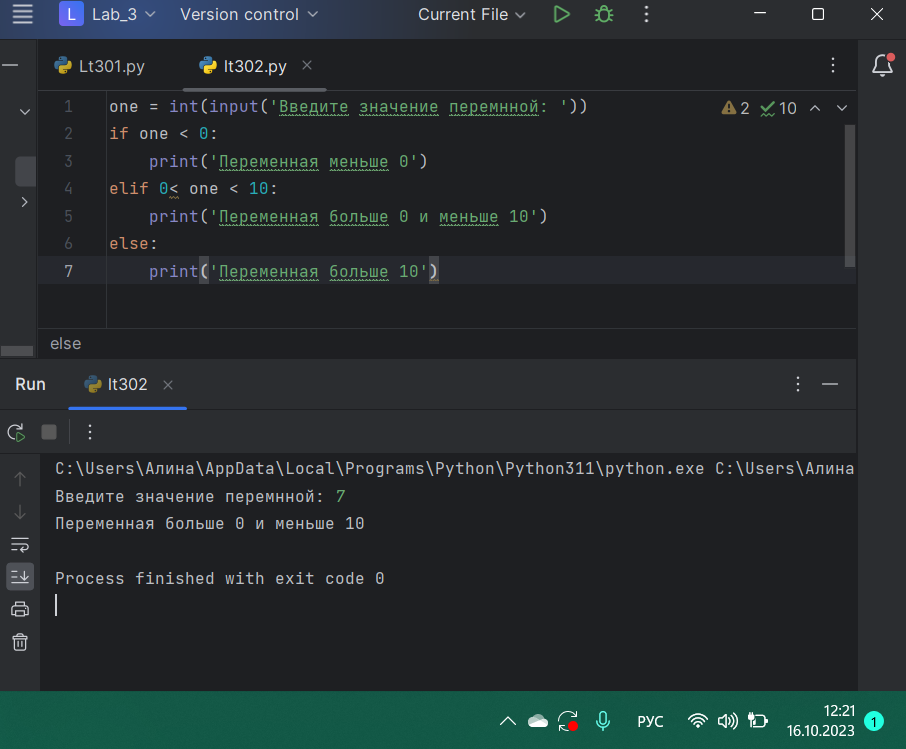

## Лабораторная работа №3
### 
```python

```
### Результат.
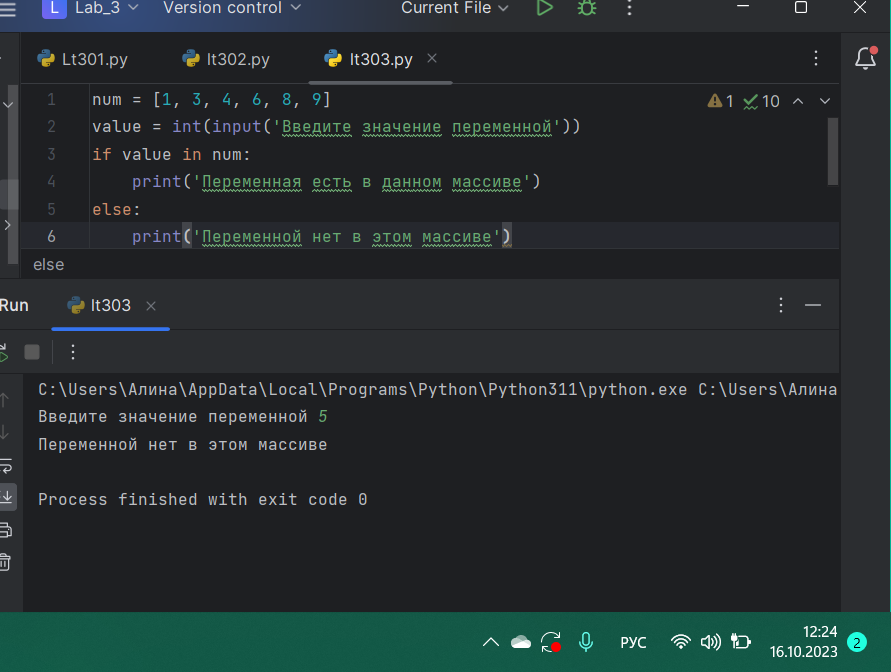

## Лабораторная работа №4
### 
```python

```
### Результат.
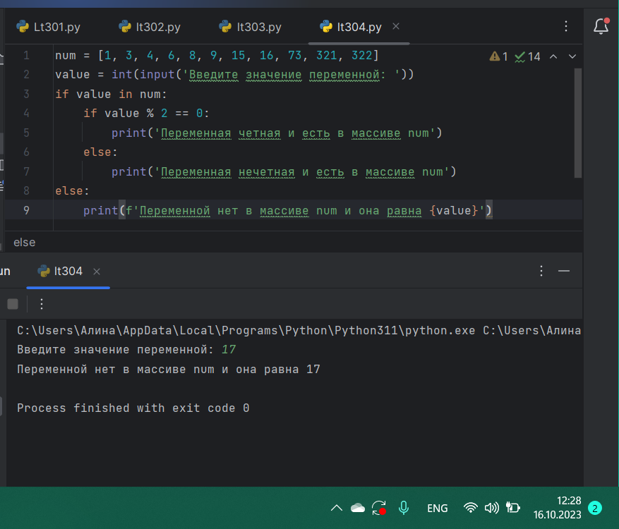

## Лабораторная работа №5
### 
```python

```
### Результат.
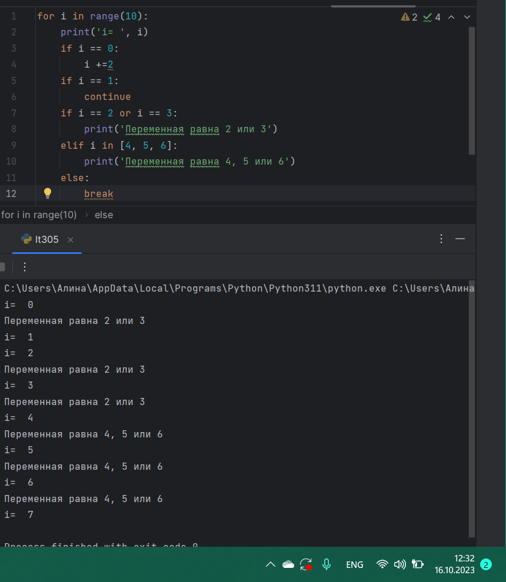

## Лабораторная работа №6
### 
```python

```
### Результат.
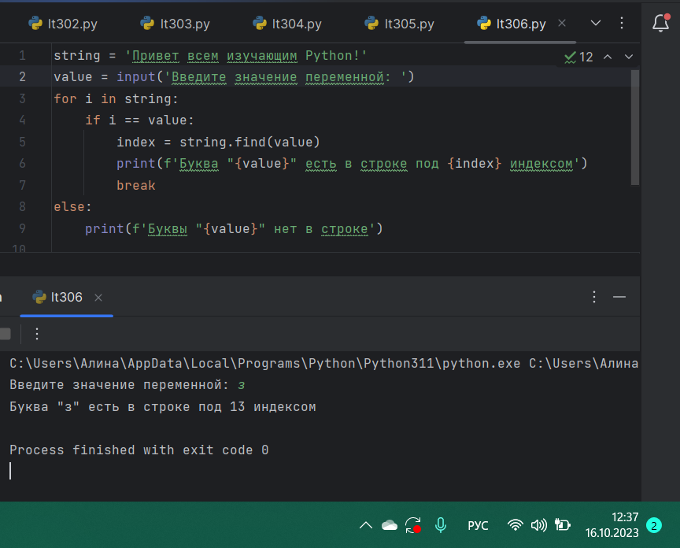

## Лабораторная работа №7
### 
```python

```
### Результат.
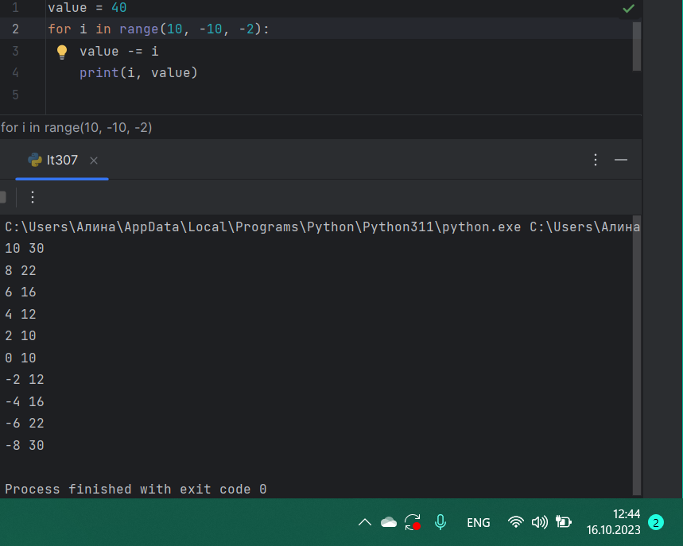

## Лабораторная работа №8
### 
```python

```
### Результат.
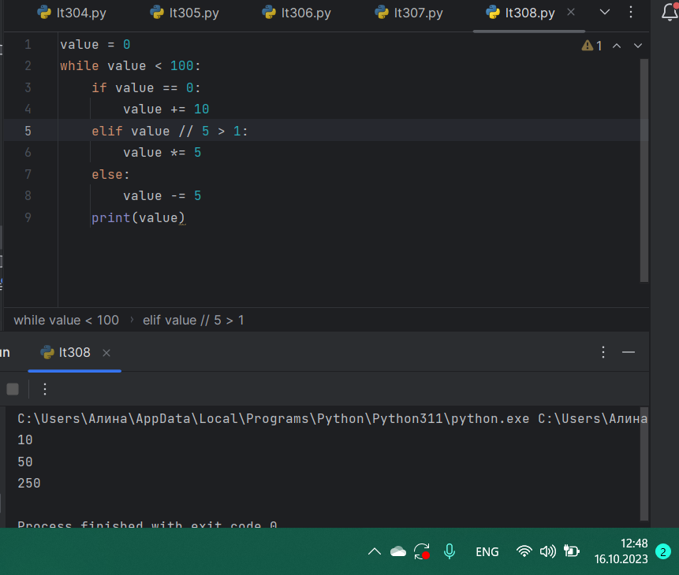

## Лабораторная работа №9
### 
```python

```
### Результат.
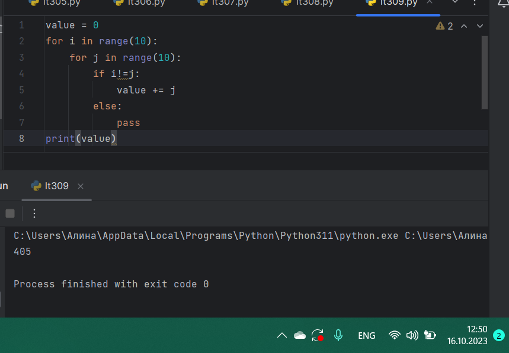

## Лабораторная работа №10
### 
```python

```
### Результат.


## Самостоятельная работа №1
### 
```python

```
### Результат.
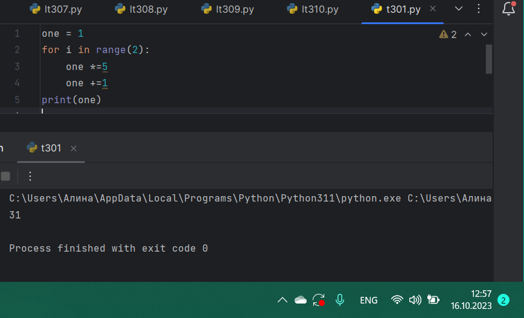

## Вывод

## Самостоятельная работа №2
### 
```python

```
### Результат.
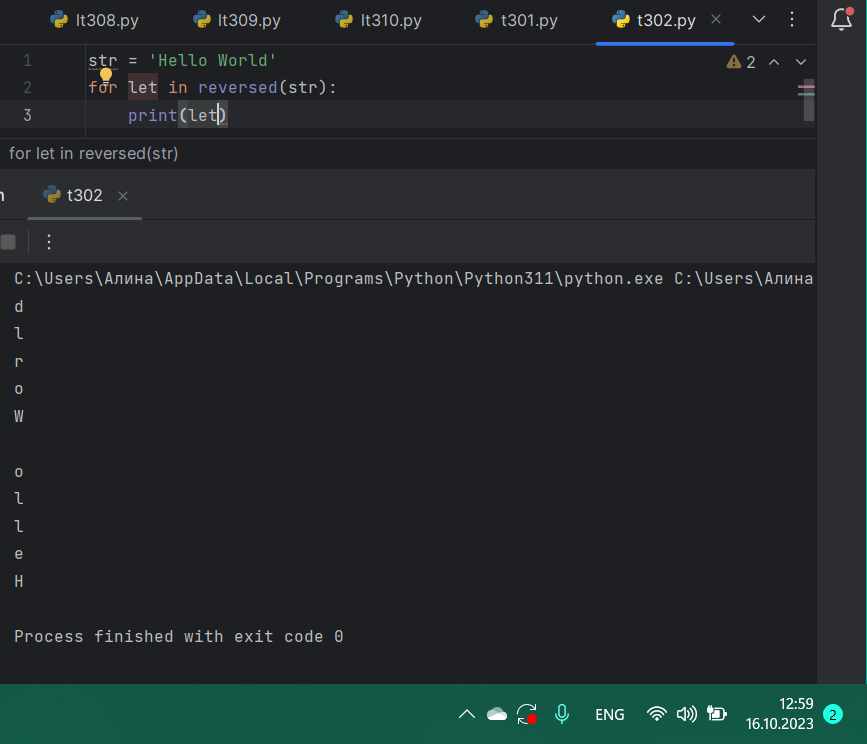

## Вывод

## Самостоятельная работа №3
### 
```python

```
### Результат.
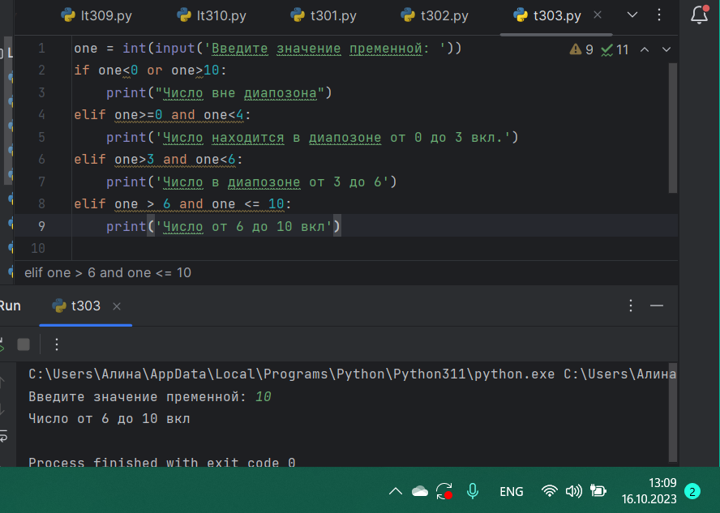

## Вывод

## Самостоятельная работа №4
### 
```python

```
### Результат.
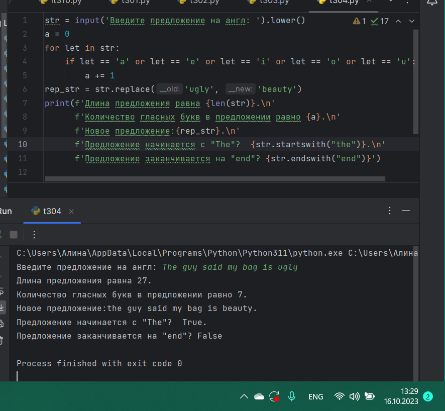

## Вывод

## Самостоятельная работа №5
### 
```python

```
### Результат.
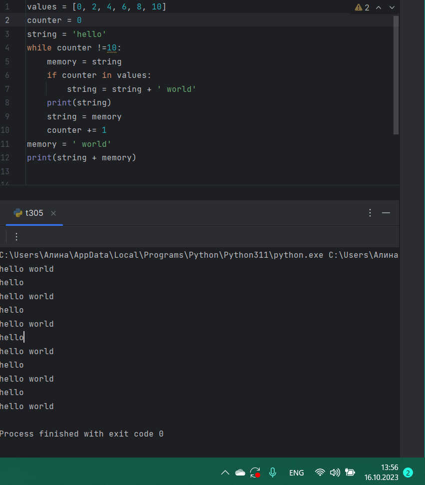

## Вывод
