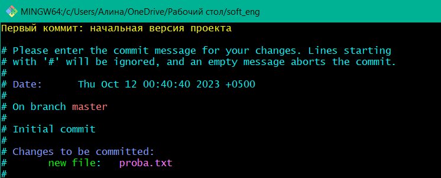

# Работа с GIT.
Отчет по Теме #1 выполнил(а):
- Фаухиева Алина
- АИС-21-1

| Задание | Лаб_раб |
| ------ | ------ |
| Задание 1 | + |
| Задание 2 | + |
| Задание 3 | + |
| Задание 4 | + |
| Задание 5 | + |
| Задание 6 | + |
| Задание 7 | + |
| Задание 8 | + |
| Задание 9 | + |
| Задание 10 | + |
| Задание 11 | + |
| Задание 12 | + |
| Задание 13 | + |
| Задание 14 | + |
| Задание 15 | + |

знак "+" - задание выполнено; знак "-" - задание не выполнено;

## Задание №1
### Установка

### Результат.

## Выводы
- Установила Git

## Задание №2
### Настройка

### Результат.

## Выводы
- В Git можно указать имя пользователя, почту

## Задание №3
### Создание нового репозитория
### Результат.

## Выводы
- В текущей папке командой git init можно создать пустой репозиторий
  
## Задание №4
### Подготовка файлов

### Результат.

## Выводы
- С помощью команды git add "file name" добавила файл 
- С помощью команды git statusпроверила какие изменения произойдут в следующем коммите 

## Задание №5
### Фиксация изменений

### Результат.

## Выводы
- Команда git commit создает snapshot состояния файлов.
- Флаг -m команды git commit позволяет добавить описания коммита
- git log позволяет просмотреть историю коммитов
- Флаг -n позволяет указать число выводимых последних коммитов
- Флаг --oneline выводит коммиты в сокращенном виде
- Флаг --graph показывает графическое дерево коммитов с ветвями и слиянеями

 ## Задание №6
### Подключение к удаленному репозиторию

### Результат.

## Выводы
- С помощью команды git remote add <Имя удаленного репозитория> <URL ссылка> подключилп локальный репозиторий к удаленном.
-А с командой git push <Имя удаленного репозитория> <Имя ветки> загрузила данные с локального репозитория на удаленный.
- скрин забыла сделать ;_(

## Задание №7
### Ветвление

### Результат.

## Выводы
- Создала ветку и переключилась на нее

## Задание №8
### Особенности применения «Фетч»

### Результат.

## Выводы
- git fetch обновляет информацию об удаленном репозитории и его ветках

## Задание №9 и №10
### Удаление файлов, веток, локальных и удалённых репозиториев. Отслеживание изменений

### Результат.

## Выводы
- git rm <Имя файла> удаляет файл
- git diff сравает изменения между коммитами или ветками
- git diff <коммит А> <коммит Б> сравнивает изменения между коммитами

## Задание №11
### Возвращение файла к предыдущему (определенному) состоянию

### Результат.

## Выводы
- С помощью git log можно определить хэш коммита
  
## Задание №12
### Возвращение к предыдущему коммиту

### Результат.

## Выводы
- git reset <--soft/--hard> <Хэш коммита> возвращает к предидущему коммиту
- Флаг --soft используется для возвращения к состоянию файла из предыдущего коммита с сохранением изменений, лучше использовть пока что это, если новичок в этой теме
- Флаг --hard используется для возвращения к состоянию файла из предидущего коммита без сохранений изменений, использовать только тогда, когда уверенна на сто процентов:)
- Тут было тяжело, но я вывезла!!
  
## Задание №13
### Исправление коммита

### Результат.

## Выводы
- git commit --amend - изменить прошлый коммит (описание, добавление файлов)
- сначала лучше узнать как выйти оттуда :)
  
## Задание №14
### Разрешение конфликтов при слиянии

## Выводы
- Проблемы были почти везде, но здесь ошибок не было. Но в будущем скорее всего в этой части будет тяжело
  
## Задание №15
### Настройка .gitignore

### Результат.

## Выводы
- Файл .gitignore содержит шаблоны и/или имена файлов и/или директорий который Git должен игнорировать
- *.<Расширение файла> - игнорирует все файлы с данным расширением ( *.log )
- <Название директории>/ - игнорирует директорию и все файлы в ней находящиеся ( directory/ )
- <Название файла> - игнорирует файл ( file )
- <Название директории>/* - игнорирует все файлы в директории но не ее саму ( directory/* )

# Глобальный вывод
Никогда не сталкивалась с git, поэтому было очень тяжело, делала почти 6 часов, но под конец выучила почти все команды! Полезная штучка для нас, айтишников. Многое узнала, а некоторые моменты даже переделывала несколько раз :) Спасибо за знания в этой области!
