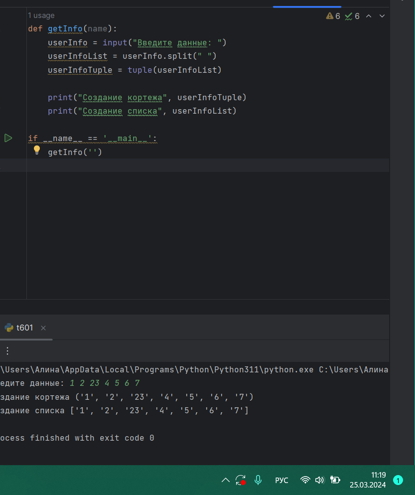
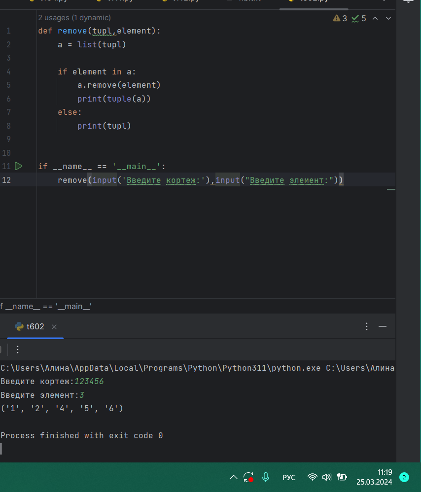
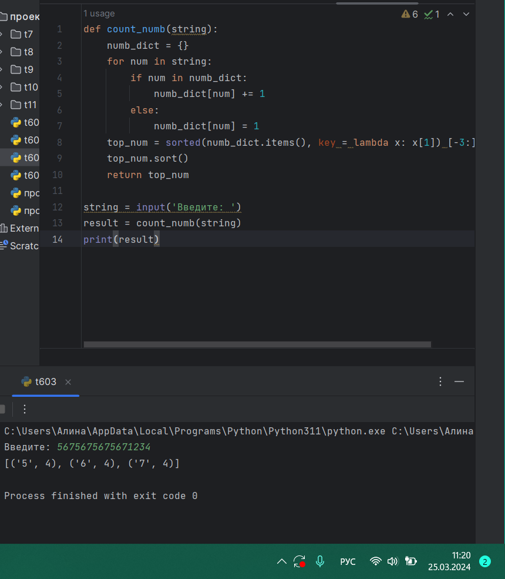
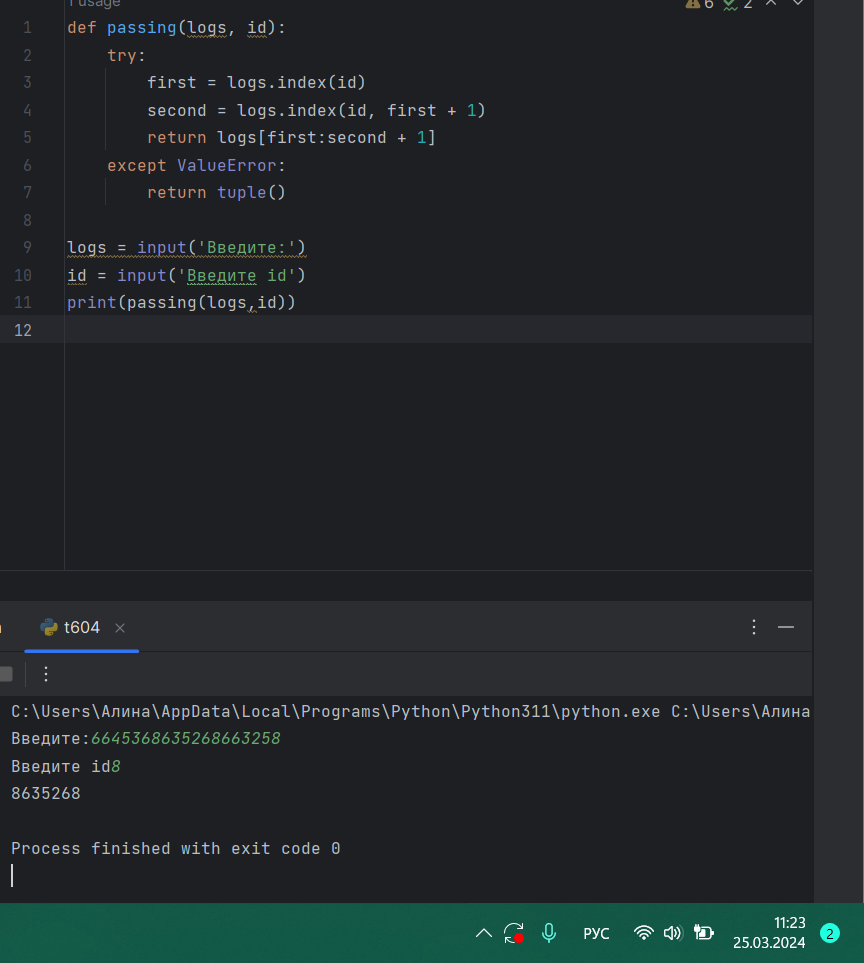
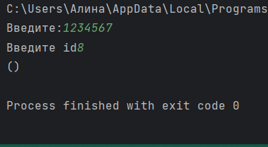

# Тема 6. Базовые коллекции: словари, кортежи
Отчет по Теме #6 выполнила:
- Фаухиева Алина Ильдаровна
- АИС-21-1

| Задание | Сам_раб | 
| ------ | ------ | 
| Задание 1 | + |
| Задание 2 | + |
| Задание 3 | + |
| Задание 4 | + |
| Задание 5 | + |

знак "+" - задание выполнено; знак "-" - задание не выполнено;

## Задание 1
### При создании сайта у вас возникла потребность обрабатывать данные пользователя в странной форме, а потом переводить их в нужные вам форматы. Вы хотите принимать от пользователя последовательность чисел, разделенных пробелом, а после переформатировать эти данные в список и кортеж. Реализуйте вашу задумку. Для получения начальных данных используйте input(). Результатом программы будет выведенный список и кортеж из начальных данных

### Результат.

## Вывод 
1)Считывает строку ввода с помощью функции input().
2)Разбивает эту строку на отдельные слова, используя пробел в качестве разделителя, и сохраняет их в виде списка
3)Создает кортеж, преобразуя список в кортеж.
4)Выводит сообщение "Создание кортежа" и сам кортеж.
5)Выводит сообщение "Создание списка" и сам список.

## Задание 2
### Николай знает, что кортежи являются неизменяемыми, но он очень упрямый и всегда хочет доказать, что он прав. Студент решил создать функцию, которая будет удалять первое появление определенного элемента из кортежа по значению и возвращать кортеж без него. Попробуйте повторить шедевр не признающего авторитеты начинающего программиста. Но учтите, что Николай не всегда уверен в наличии элемента в кортеже(в этом случае кортеж вернется функцией в исходном виде). Входные данные: (1, 2, 3), 1) (1, 2, 3, 1, 2, 3, 4, 5, 2, 3, 4, 2, 4, 2), 3) (2, 4, 6, 6, 4, 2), 9) Ожидаемый результат: (2, 3) (1, 2, 1, 2, 3, 4, 5, 2, 3, 4, 2, 4, 2) (2, 4, 6, 6, 4, 2)

## Выводы

В данном коде создается функция remove, которая принимает два аргумента: tupl - исходный кортеж и element - элемент, который нужно удалить.

Сначала кортеж tupl преобразуется в список a при помощи функции list(), чтобы можно было удалить элемент. 

Затем проверяется, содержится ли элемент element в списке a с помощью оператора in. Если элемент найден, то при помощи метода remove() он удаляется из списка a.

После этого список a преобразуется обратно в кортеж при помощи функции tuple() и выводится на консоль.

Если элемент element не найден в кортеже tupl, то функция возвращает исходный кортеж без изменений.

## Задание 3
### Ребята поспорили кто из них одним нажатием на numpad наберет больше повторяющихся цифр, но не понимают, как узнать победителя. Вам им нужно в этом помочь. Дана строка в виде случайной последовательности чисел от 0 до 9 (длина строки минимум 15 символов). Требуется создать словарь, который в качестве ключей будет принимать данные числа (т. е. ключи будут типом int), а в качестве значений – количеств этих чисел в имеющейся последовательности. Для построения словаря создайте функцию, принимающую строку из цифр. Функция должна возвратить словарь из 3-х самых часто встречаемых чисел, также эти значения нужно вывести в порядке возрастания ключа.

## Выводы
1. Создать функцию с именем count_numb, которая принимает один аргумент string - строку из цифр.
2. Инициализировать пустой словарь с именем numb_dict, который будет использоваться для хранения количества повторяющихся чисел.
3. Пройтись в цикле по каждому символу в строке.
4. Для каждого символа проверить, есть ли он уже в словаре numb_dict.
5. Если символ уже присутствует в словаре, то увеличить его значение на 1.
6. Если символ отсутствует в словаре, то добавить его в словарь со значением 1.
7. После окончания цикла получить три самых часто встречающихся числа из словаря numbers_dict.
8. Отсортировать полученные числа в порядке возрастания ключа.
9. Вернуть полученный результат.

  
## Задание 4
### Ваш хороший друг владеет офисом со входом по электронным картам, ему нужно чтобы вы написали программу, которая показывала в каком порядке сотрудники входили и выходили из офиса. Определение сотрудника происходит по id. Напишите функцию, которая на вход принимает кортеж и случайный элемент (id), его можно придумать самостоятельно. Требуется вернуть новый кортеж, начинающийся с первого появления элемента в нем и заканчивающийся вторым его появлением включительно. Если элемента нет вовсе – вернуть пустой кортеж. Если элемент встречается только один раз, то вернуть кортеж, который начинается с него и идет до конца исходного. Входные данные: (1, 2, 3), 8) (1, 8, 3, 4, 8, 8, 9, 2), 8) (1, 2, 8, 5, 1, 2, 9), 8) Ожидаемый результат: () (8, 3, 4, 8) (8, 5, 1, 2, 9)

## Выводы
1. def passing(logs, id): - объявление функции passing() с параметрами logs и id.
2. try: - начало блока try-except. Мы будем отлавливать исключение ValueError, которое возникает, если элемент id не найден в кортеже logs.
3. first = logs.index(id) - находим индекс первого вхождения элемента id в кортеже logs.
4. second = logs.index(id, first + 1) - находим индекс второго вхождения элемента id в кортеже logs, начиная с позиции first + 1.
5. return logs[first:second + 1] - возвращаем новый кортеж, начиная с первого вхождения и заканчивая вторым включительно.
6. except ValueError: - обрабатываем исключение ValueError, если элемент id не найден в кортеже logs или встречается только один раз.
7. return tuple() - возвращаем пустой кортеж, если элемента нет в кортеже, или кортеж, начиная с элемента и идущий до конца.

## Задание 5
### 5)	Самостоятельно придумайте и решите задачу, в которой будут обязательно использоваться кортеж или список. Проведите минимум три теста для проверки работоспособности вашей задачи.
