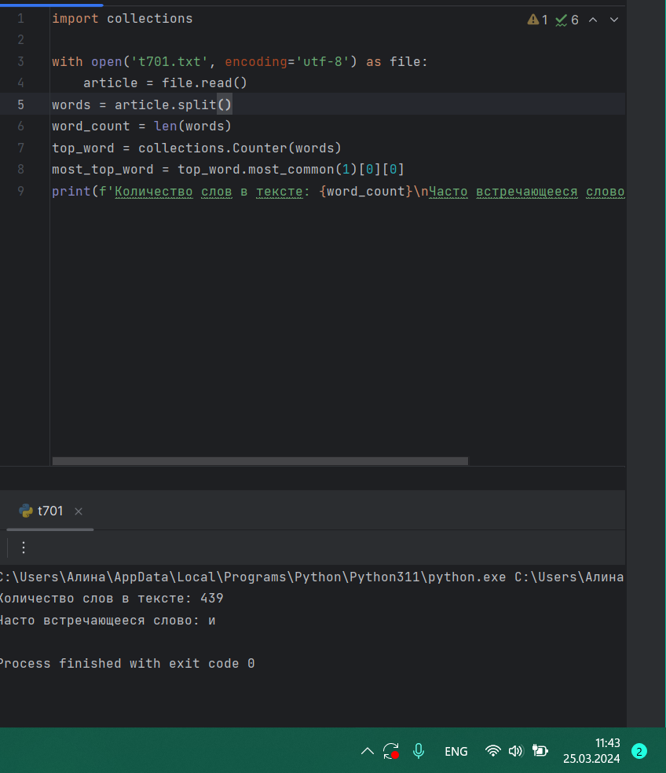
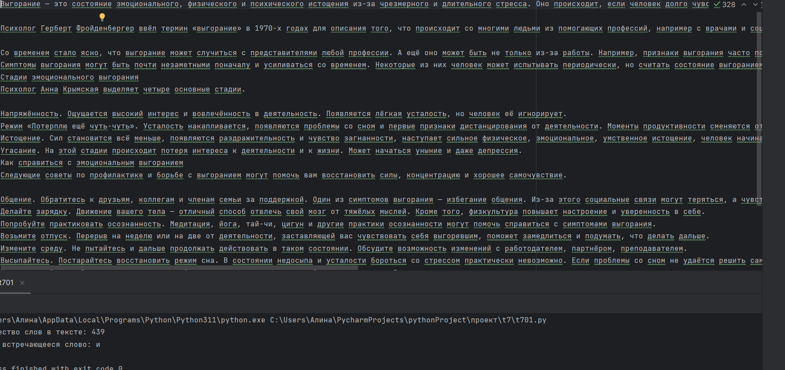
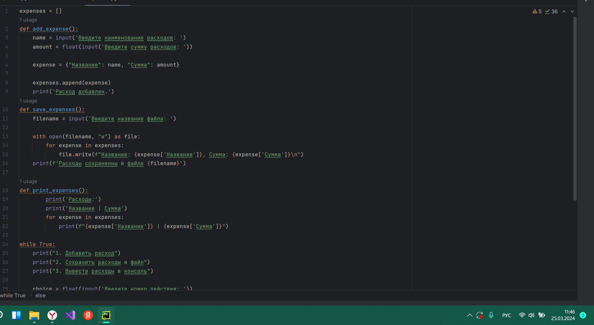
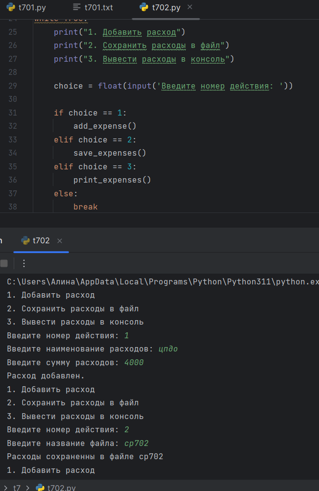
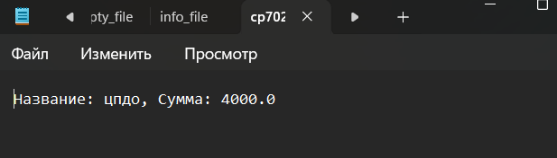
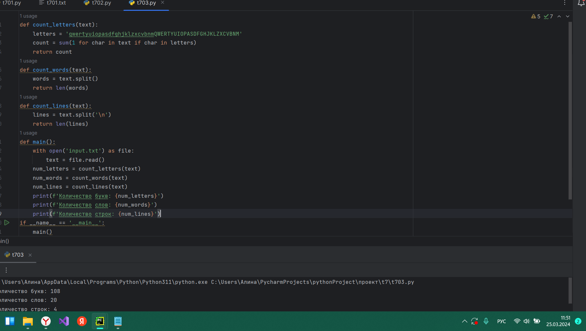
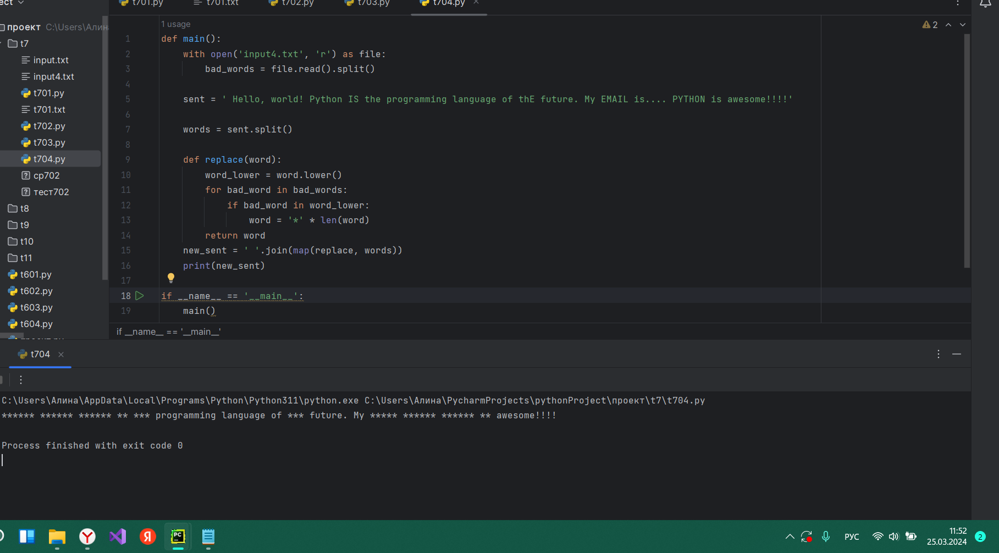

# Тема 7. Работа с файлами (ввод, вывод)
Отчет по Теме #7 выполнила:
- Фаухиева Алина Ильдаровна
- АИС-21-1

| Задание | Сам_раб | 
| ------ | ------ | 
| Задание 1 | + |
| Задание 2 | + |
| Задание 3 | + |
| Задание 4 | + |
| Задание 5 | - |

знак "+" - задание выполнено; знак "-" - задание не выполнено;

## Задание 1
### Найдите в интернете любую статью (объем статьи не менее 200 слов), скопируйте ее содержимое в файл и напишите программу, которая считает количество слов в текстовом файле и определит самое часто встречающееся слово. Результатом выполнения задачи будет: скриншот файла со статьей, листинг кода, и вывод в консоль, в котором будет указана вся необходимая информация

### Результат.

## Вывод 
1)Открывает файл, читает его содержимое
2)Разбивает текст на слова и создает словарь word_count для подсчета количества вхождений каждого слова, приводя слова к нижнему регистру для регистронезависимого подсчета.
3)Находит максимальное количество вхождений слова и определяет слова с этим количеством вхождений.
4)Выводит общее количество слов, а также слова с наибольшим количеством вхождений.

## Задание 2
### У вас появилась потребность в ведении книги расходов, посмотрев все существующие варианты вы пришли к выводу что вас ничего не устраивает и нужно все делать самому. Напишите программу для учета расходов. Программа должна позволять вводить информацию о расходах, сохранять ее в файл и выводить существующие данные в консоль. Ввод информации происходит через консоль. Результатом выполнения задачи будет: скриншот файла с учетом расходов, листинг кода, и вывод в консоль, с демонстрацией работоспособности программы

## Выводы
В данном коде мы используем список expenses для хранения информации о расходах. 

Функция add_expense запрашивает у пользователя наименование и сумму расхода, создает словарь, содержащий эту информацию, и добавляет его в список expenses.

Функция save_expenses запрашивает у пользователя имя файла для сохранения и открывает этот файл в режиме записи. Затем она итерирует по каждому расходу в списке expenses, записывает информацию о расходе в файл в формате "Наименование: Сумма".

Функция print_expenses выводит информацию о расходах в консоль. Она создает таблицу с заголовками "Наименование" и "Сумма" и затем итерирует по каждому расходу в списке expenses, выводя его информацию в таблицу.

В основном цикле программы мы выводим меню действий для пользователя и запрашиваем его выбор. В зависимости от выбранного действия, мы вызываем соответствующую функцию или выходим из программы, если пользователь выбрал "0".

## Задание 3
### Имеется файл input.txt с текстом на латинице. Напишите программу, которая выводит следующую статистику по тексту: количество букв латинского алфавита; число слов; число строк. • Текст в файле: Beautiful is better than ugly. Explicit is better than implicit. Simple is better than complex. Complex is better than complicated.Ожидаемый результат: Input file contains: 108 letters 20 words 4 lines

## Выводы
1)Открывает файл "input.txt" для чтения и считывает его содержимое.
2)Затем она анализирует текст и подсчитывает следующие статистические данные:
  Количество букв латинского алфавита (a-zA-Z).
  Количество слов в тексте (разделенных пробелами и символами новой строки).
  Количество строк в тексте (разделенных символами новой строки).
3)После анализа программа выводит статистику, включая количество букв, количество слов и количество строк в тексте.

  
## Задание 4
### Напишите программу, которая получает на вход предложение, выводит его в терминал, заменяя все запрещенные слова звездочками * (количество звездочек равно количеству букв в слове). Запрещенные слова, разделенные символом пробела, хранятся в текстовом файле input.txt. Все слова в этом файле записаны в нижнем регистре. Программа должна заменить запрещенные слова, где бы они ни встречались, даже в середине другого слова. Замена производится независимо от регистра: если файл input.txt содержит запрещенное слово exam, то слова exam, Exam, ExaM, EXAM и exAm должны быть заменены на ****. 
• Запрещенные слова: hello email python the exam wor is 
• Предложение для проверки: Hello, world! Python IS the programming language of thE future. My EMAIL is.... PYTHON is awesome!!!! 
• Ожидаемый результат: *****, ***ld! ****** ** *** programming language of *** future. My ***** **.... ****** ** awesome!!!!

## Выводы
1)Открывает файл "input4.txt", читает из него запрещенные слова и сохраняет их в список bad_words.
2)Задает предложение sent для проверки, содержащее текст, в котором нужно заменить запрещенные слова.
3)Разбивает предложение на отдельные слова и создает список words.
4)Затем определяет функцию replace(word), которая приводит слово к нижнему регистру и заменяет запрещенные слова в предложении звездочками.
5)Заменяет запрещенные слова в предложении и выводит его на экран с использованием print.

## Задание 5
### Самостоятельно придумайте и решите задачу, которая будет взаимодействовать с текстовым файлом.

