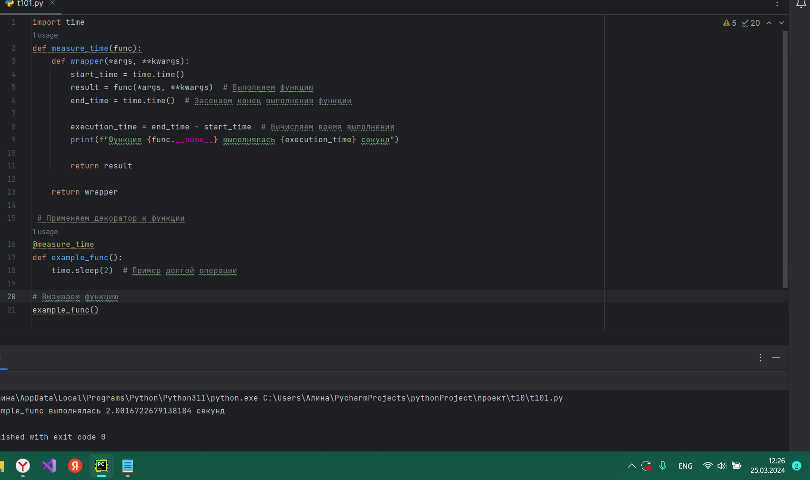
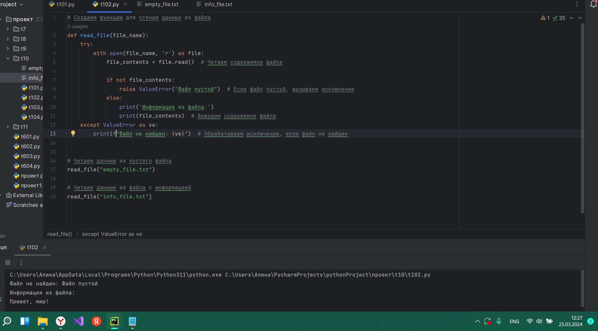
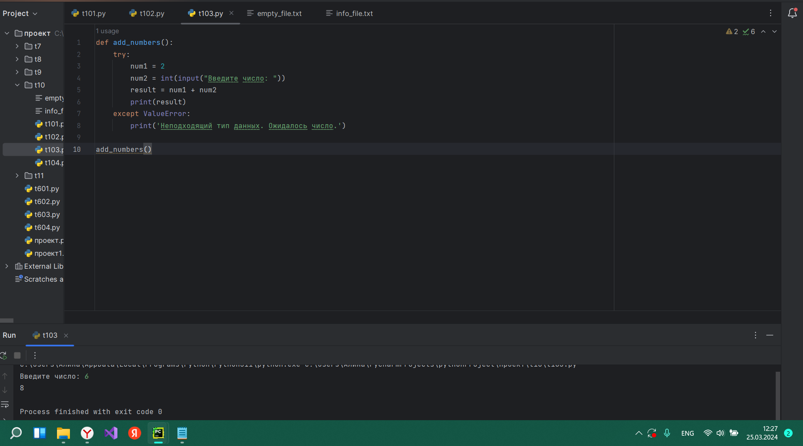
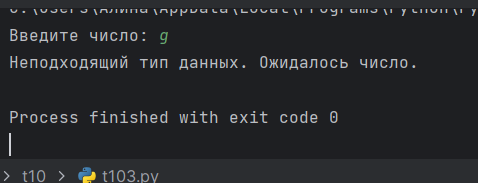
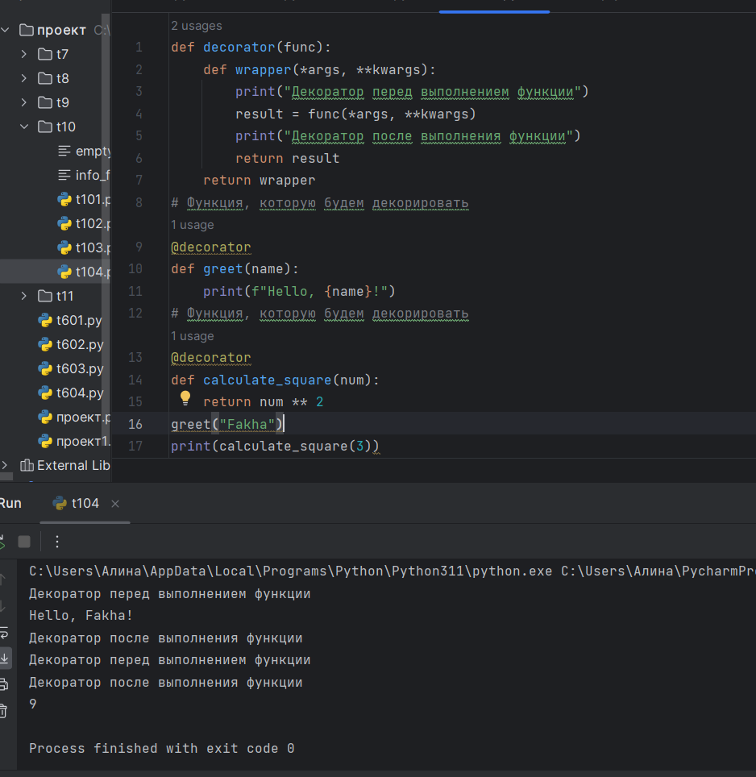

# Тема 10. Декораторы и исключения.
Отчет по Теме #10 выполнил:
- Фаухиева Алина Ильдаровна
- АИС-21-1

| Задание | Сам_раб | 
| ------ | ------ | 
| Задание 1 | + |
| Задание 2 | + |
| Задание 3 | + |
| Задание 4 | + |
| Задание 5 | + |

знак "+" - задание выполнено; знак "-" - задание не выполнено;

## Задание 1. Вовочка решил заняться спортивным программированием на python, но для этого он должен знать за какое время выполняется его программа. Он решил, что для этого ему идеально подойдет декоратор для функции, который будет выяснять за какое время выполняется та или иная функция. Помогите Вовочке в его начинаниях и напишите такой декоратор. Подсказка: необходимо использовать модуль time.

### Результат.

## Вывод. 
В данном коде создается декоратор measure_time, который измеряет время выполнения функции и выводит его в консоль. Декоратор применяется к функции example_func, которая вызывается с некоторой задержкой (эмулирует долгую операцию). После вызова функции в консоль выводится время ее выполнения.

## Задание 2. Посмотрев на Вовочку, вы также загорелись идеей спортивного программирования, начав тренировки вы узнали, что для решения некоторых задач необходимо считывать данные из файлов. Но через некоторое время вы столкнулись с проблемой что файлы бывают пустыми, и вы не получаете вводные данные для решения задачи. После этого вы решили не просто считывать данные из файла, а всю конструкцию оборачивать в исключения, чтобы избежать такой проблемы. Создайте пустой файл и файл, в котором есть какая-то информация. Напишите код программы. Если файл пустой, то, нужно вызвать исключение (“бросить исключение”) и вывести в консоль “файл пустой”, а если он не пустой, то вывести информацию из файла

### Результат.

## Вывод. 
В данном коде создается функция read_file, которая с помощью конструкции try...except пытается прочитать данные из файла и выводит их в консоль. Если файл пустой, вызывается исключение и выводится сообщение "Файл пустой". Если файл не найден, обрабатывается исключение и выводится сообщение "Файл не найден".

Затем создается пустой файл empty_file.txt и файл info_file.txt, содержащий строку "Привет, мир!". Функция read_file вызывается дважды: первый раз для чтения пустого файла, второй раз - для чтения файла с информацией. В результате первого вызова выведется сообщение "Файл пустой", а второго вызова будет выведена информация из файла.

## Задание 3.Напишите функцию, которая будет складывать 2 и введенное пользователем число, но если пользователь введет строку или другой неподходящий тип данных, то в консоль выведется ошибка “Неподходящий тип данных. Ожидалось число.”. Реализовать функционал программы необходимо через try/except и подобрать правильный тип исключения. Создавать собственное исключение нельзя. Проведите несколько тестов, в которых исключение вызывается и нет. Результатом выполнения задачи будет листинг кода и получившийся вывод в консоль 

### Результат.

## Вывод. При вводе числа программа выведет результат сложения. При вводе строки или другого неподходящего типа данных, программа поймает исключение ValueError и выведет соответствующее сообщение об ошибке. В тестах приведены примеры с разными типами ввода

## Задание 4. Создайте собственный декоратор, который будет использоваться для двух любых вами придуманных функций. Декораторы, которые использовались ранее в работе нельзя воссоздавать. Результатом выполнения задачи будет: класс декоратора, две как-то связанными с ним функциями, скриншот консоли с выполненной программой и подробные комментарии, которые будут описывать работу вашего кода.

### Результат.

## Вывод.
В данном коде определяется декоратор decorator, который принимает функцию func, а затем определяет и возвращает функцию wrapper. Функция wrapper добавляет логику, которая будет выполняться перед и после вызова функции func.

Затем, используя декоратор decorator, мы декорируем две функции - greet и calculate_square. При вызове этих функций, декоратор decorator будет автоматически применяться к ним.

При вызове функции greet("fakha"), сначала будет выполняться код внутри декоратора decorator, который выводит "декоратор перед выполнением функции". Затем выполняется код функции greet и выводится "hello, fakha!". После выполнения функции снова выполняется код внутри декоратора, который выводит "декоратор после выполнения функции".

При вызове функции calculate_square(3), применяется аналогичная логика. Внутри декоратора выводится "декоратор перед выполнением функции", затем выполняется код функции calculate_square, которая возвращает значение 9. После этого снова выполняется код внутри декоратора, который выводит "декоратор после выполнения функции", после чего возвращается результат выполнения функции.

## Задание 5. Создайте собственное исключение, которое будет использоваться в двух любых фрагментах кода. Исключения, которые использовались ранее в работе нельзя воссоздавать. Результатом выполнения задачи будет: класс исключения, код к котором в двух местах используется это исключение, скриншот консоли с выполненной программой и подробные комментарии, которые будут описывать работу вашего кода.

### Результат.

## Вывод. Этот код включает две функции, каждая из которых использует собственное исключение CustomException.
