# Тема 2. Базовые операции языка Python
Отчет по Теме #2 выполнила:
- Фаухиева Алина Ильдаровна
- АИС-21-1

| Задание | Лаб_раб | Сам_раб |
| ------ | ------ | ------ |
| Задание 1 | + | + |
| Задание 2 | + | + |
| Задание 3 | + | + |
| Задание 4 | + | + |
| Задание 5 | + | + |
| Задание 6 | + | + |
| Задание 7 | + | + |
| Задание 8 | + | + |
| Задание 9 | + | + |
| Задание 10 | + | + |

знак "+" - задание выполнено; знак "-" - задание не выполнено;

Работу проверили:
- к.э.н., доцент Панов М.А.

## Лабораторная работа №1
### Выведите в консоль три строки. Первая – любое число. Вторая – любое число в виде строки. Третья – любое число с плавающей точкой.

```python
print(123)
print('123')
print(1.23)
```
### Результат.
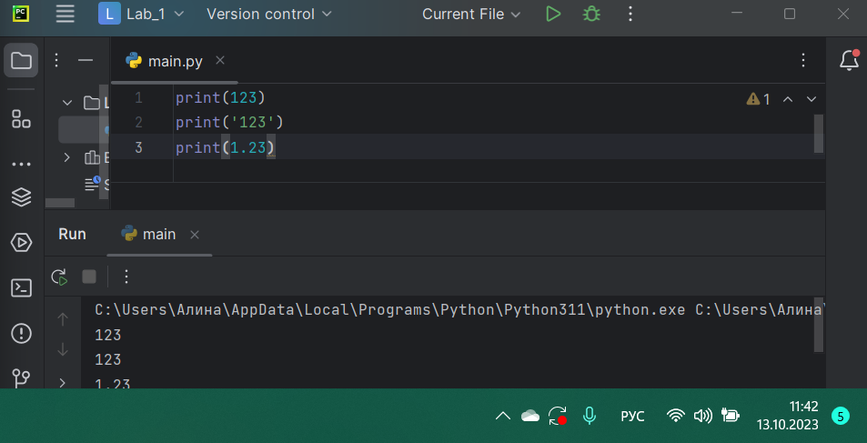

## Лабораторная работа №2
### Выведите в консоль три строки. Первая – результат сложения или вычитания минимум двух переменных типа int. Вторая – результат сложения или вычитания минимум двух переменных типа float. Третья – результат сложения или вычитания минимум двух переменных типа int и float.
## Результат


## Лабораторная работа №3
###Выведите в консоль три строки. Первая – обычная строка.  Вторая – F строка с использованием заранее объявленной переменной. Третья – сложите две или более строк в одну.
## Результат
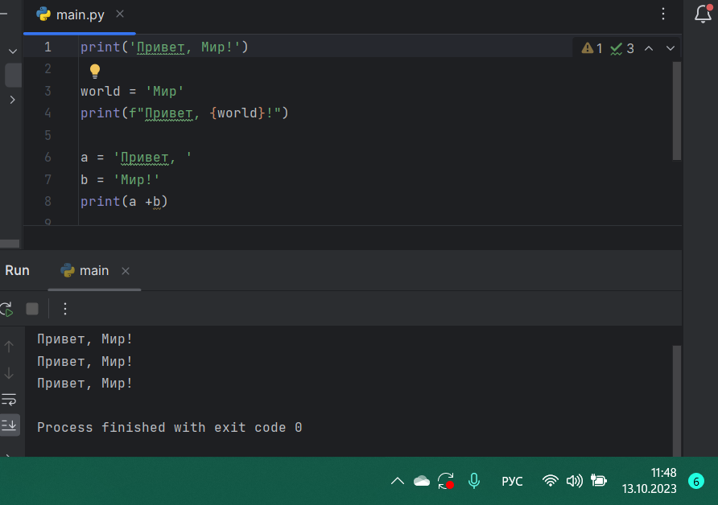


## Лабораторная работа №4
### Выведите в консоль три строки. Первая – трансформация любого типа переменной в bool. Вторая – трансформация любого типа переменной в float или int. Третья – трансформация любого типа переменной в str.
## Результат
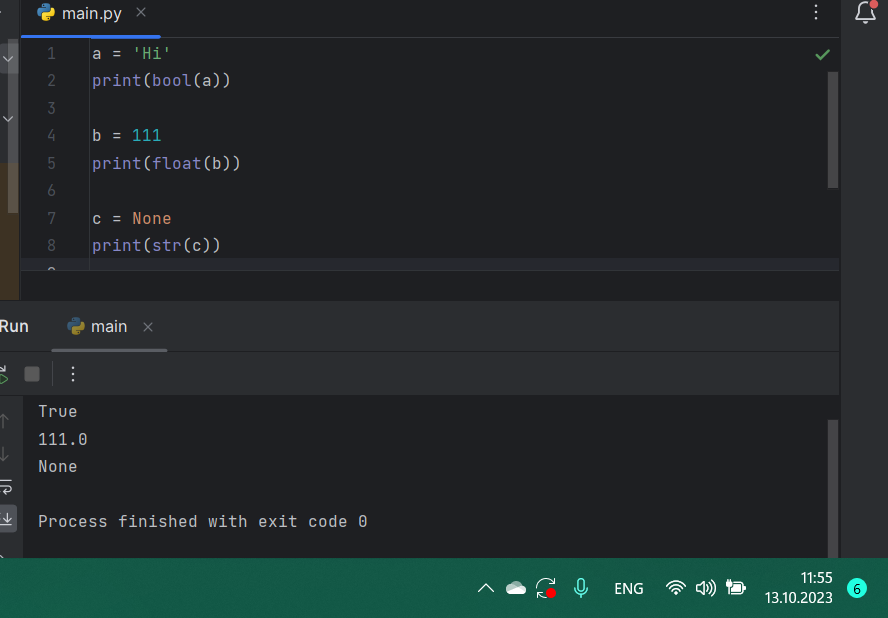

## Лабораторная работа №5
### Присвойте трем переменным различные значения, воспользовавшись функцией input()
## Результат
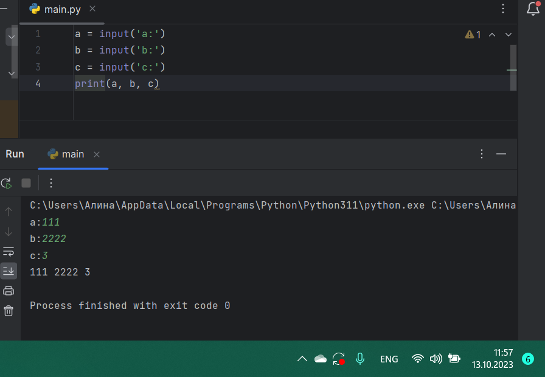

## Лабораторная работа №6
### Создайте две любые числовые переменные и выполните над ними несколько математических операций: возведение в степень, обычное деление, целочисленное деление, нахождение остатка от деления. При желании вы можете проверить как работают эти вычисления с разными типами данных, например, сначала создать две переменные int, затем создать две переменные float и наконец создать переменные типа int и float и наконец создать переменные типа int и float и провести над ними операции, прописанные выше.
## Результат
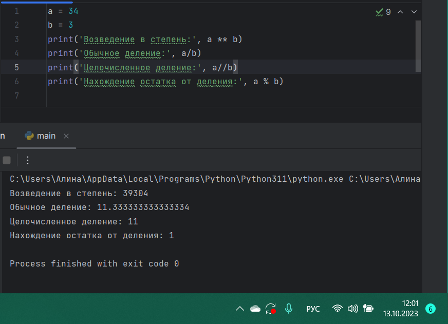

## Лабораторная работа №7
### Создайте любую строковую переменную и произведите над ней математическое действие умножение на любое число
## Результат
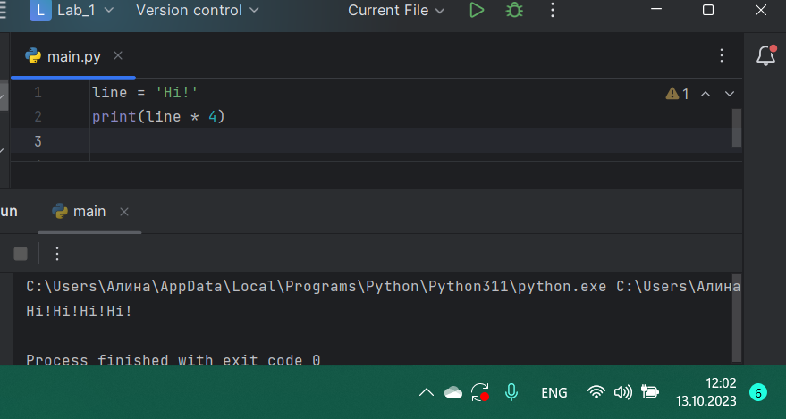

## Лабораторная работа №8
### Посчитайте сколько раз символ ‘o’ встречается в строке ‘Hello World’.
## Результат
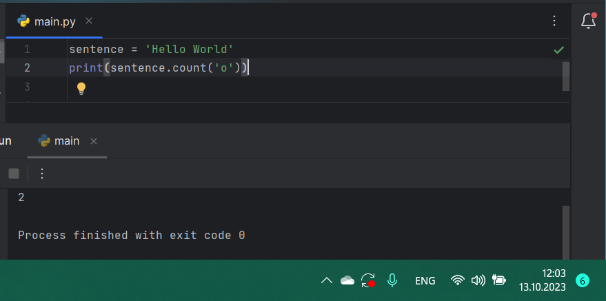

## Лабораторная работа №9
### Напишите предложение ‘Hello World’ в две строки. Написанная программа должна занимать одну строку в редакторе кода
## Результат
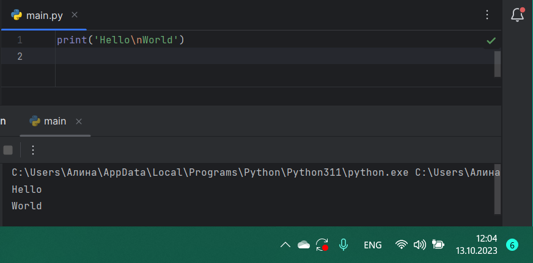

## Лабораторная работа №10
###  Из предложения ‘Hello World’ выведите в консоль только 2 символ, а затем выведите слово ‘Hello’
## Результат
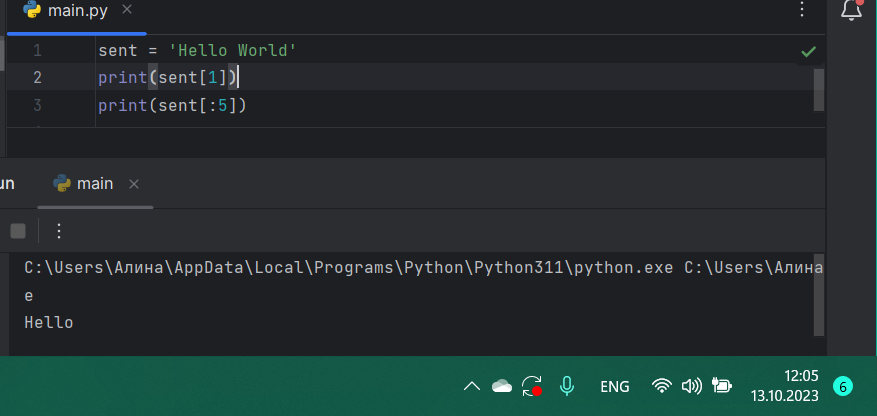

## Самостоятельная работа №1
## Выведите в консоль булевую переменную False, не используя слово False в строке или изначально присвоенную булевую переменную. Программа должна занимать не более двух строк редактора кода.
```python

```
### Результат
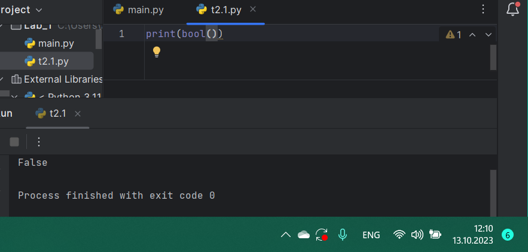
## Вывод

## Самостоятельная работа №2
## Присвоить значения трем переменным и вывести их в консоль, используя только две строки редактора кода
```python

```
### Результат
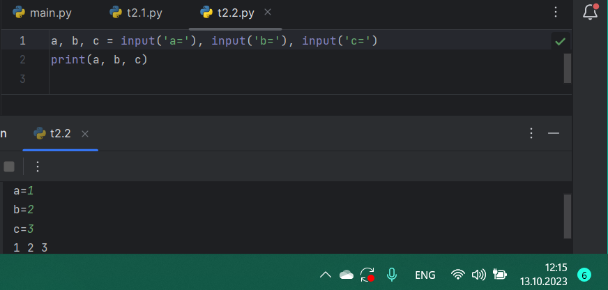
## Вывод

## Самостоятельная работа №3
## Реализуйте ввод данных в программу, через консоль, в виде только целых чисел (тип данных int). То есть при вводе буквенных символов в консоль, программа не должна работать. Программа должна занимать не более двух строк редактора кода.
```python

```
### Результат
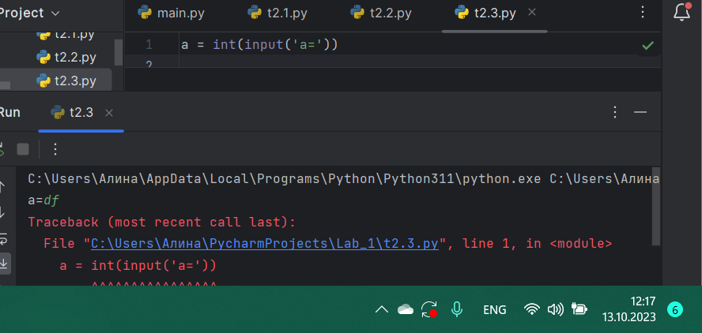
## Вывод

## Самостоятельная работа №4
## Создайте только одну строковую переменную. Длина строки должна не превышать 5 символов. На выходе мы должны получить строку длиной не менее 16 символов. Программа должна занимать не более двух строк редактора кода.
```python

```
### Результат
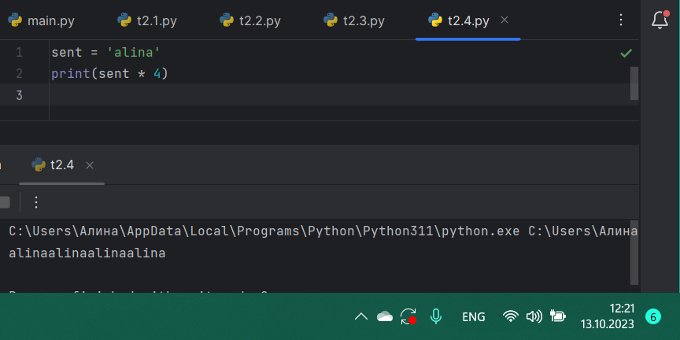
## Вывод

## Самостоятельная работа №5
##
```python

```
### Результат
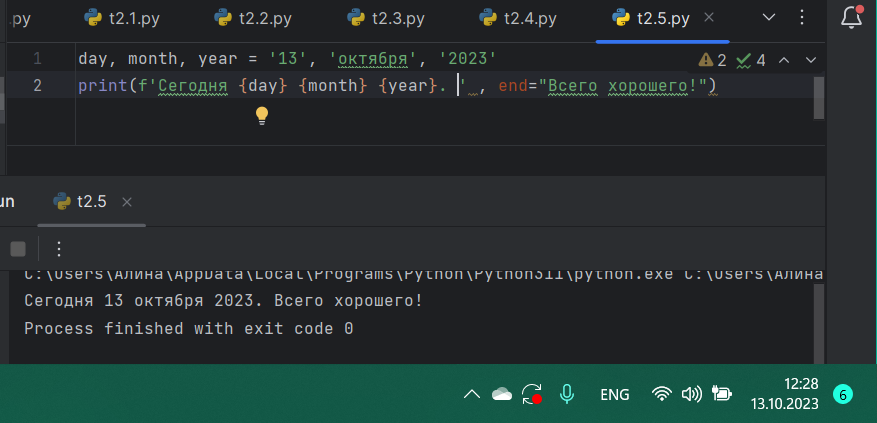
## Вывод

## Самостоятельная работа №6
##
```python

```
### Результат
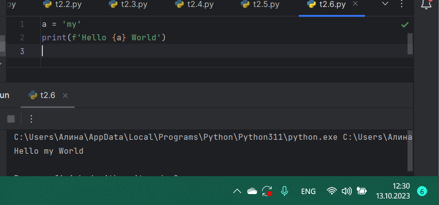
## Вывод

## Самостоятельная работа №7
##
```python

```
### Результат
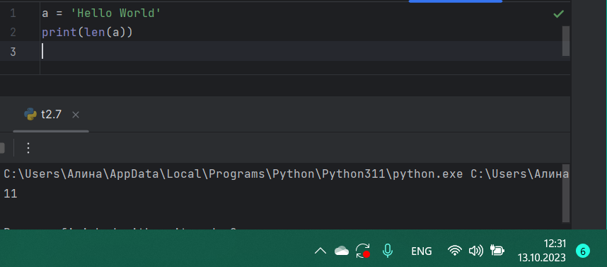
## Вывод

## Самостоятельная работа №8
##
```python

```
### Результат
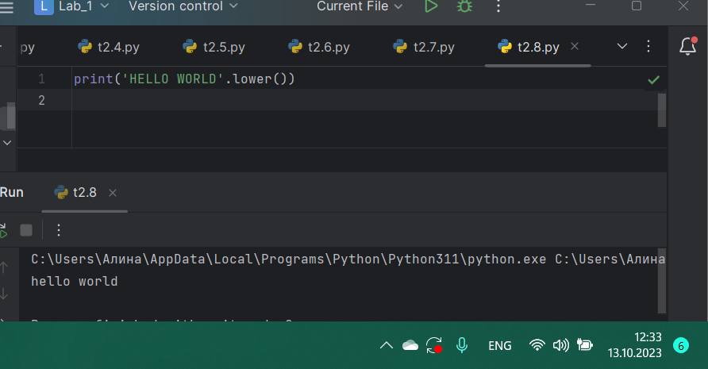
## Вывод

## Самостоятельная работа №9
##
```python

```
### Результат
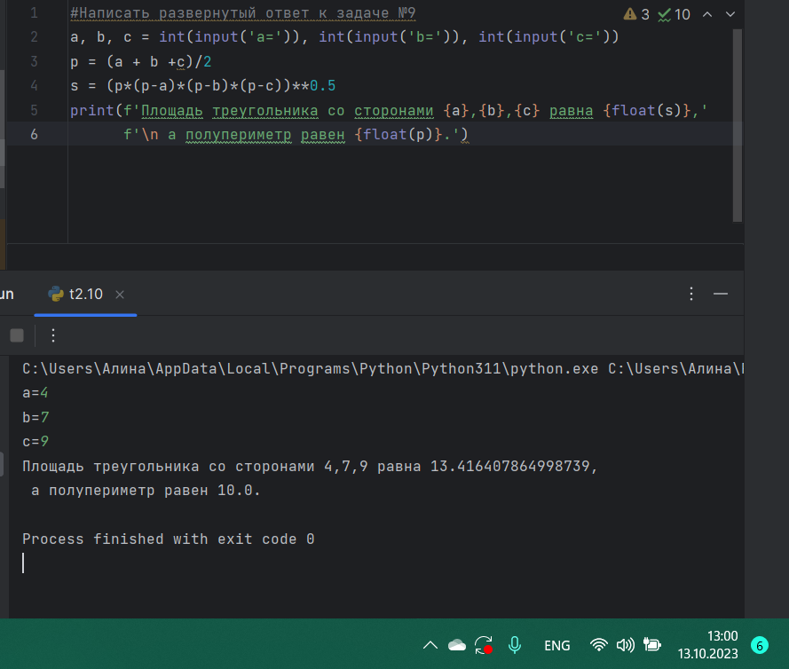
## Вывод

## Самостоятельная работа №10
##
```python

```
### Результат
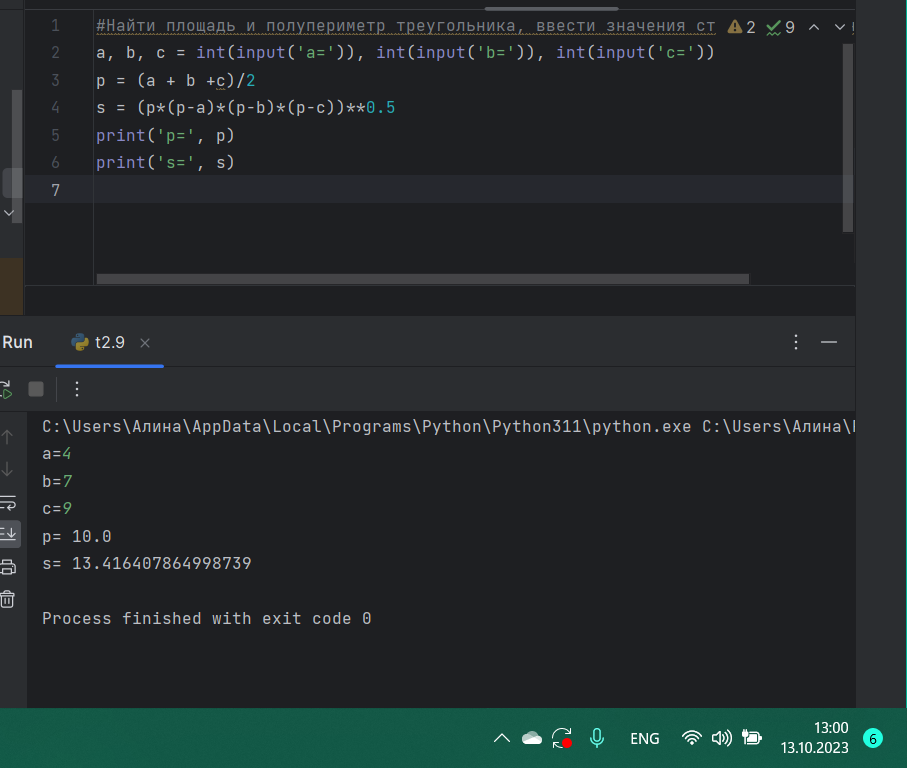
## Вывод
