# Тема 4. Функции и модули.
Отчет по Теме #4 выполнила:
- Фаухиева Алина Ильдаровна
- АИС-21-1

| Задание | Лаб_раб | Сам_раб |
| ------ | ------ | ------ |
| Задание 1 | + | + |
| Задание 2 | + | + |
| Задание 3 | + | + |
| Задание 4 | + | + |
| Задание 5 | + | + |
| Задание 6 | + |
| Задание 7 | + | 
| Задание 8 | + | 
| Задание 9 | + | 
| Задание 10 | + | 

знак "+" - задание выполнено; знак "-" - задание не выполнено;

Работу проверили:
- к.э.н., доцент Панов М.А.

## Лабораторная работа №1
### Напишите функцию, которая выполняет любые арифметические действия и выводит результат в консоль. Вызовите функцию используя “точку входа”

### Результат.
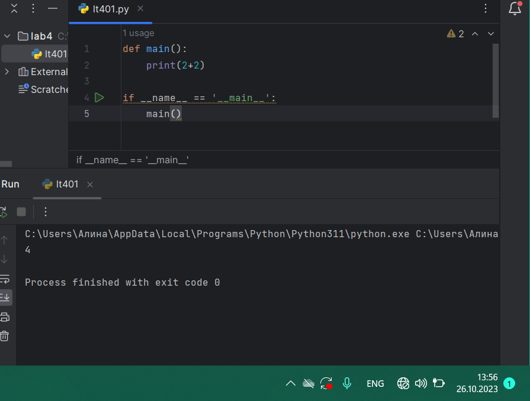

## Лабораторная работа №2
### Напишите функцию, которая выполняет любые арифметические действия, возвращает при помощи return значение в место, откуда вызывали функцию. Выведите результат в консоль. Вызовите функцию используя “точку входа”

### Результат.
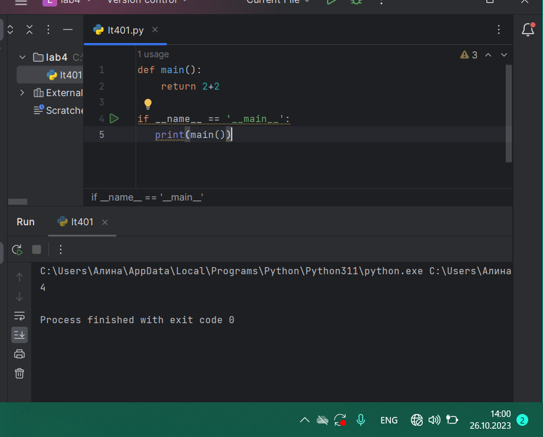
## Лабораторная работа №3
### Напишите функцию, в которую передаются два аргумента, над ними производится арифметическое действие, результат возвращается туда, откуда эту функцию вызывали. Выведите результат в консоль. Вызовите функцию в любом небольшом цикле.На скриншоте ниже приведен пример программы, в которой аргумент функции “x“превращается в параметр “one”, то же самое происходит с “y” и “tw

### Результат.
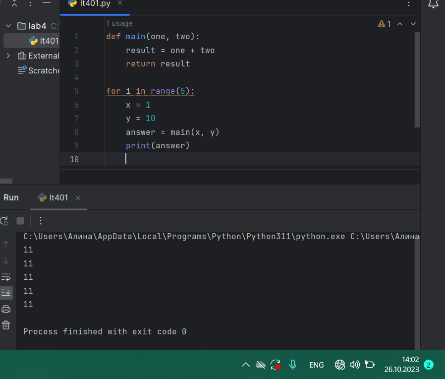

## Лабораторная работа №4
### Напишите функцию, на вход которой подается какое-то изначальное неизвестное количество аргументов, над которыми будет производится арифметические действия. Для выполнения задания необходимо использовать кортеж “*args”. На скриншоте ниже приведен пример такой программы с комментариями. 


### Результат.
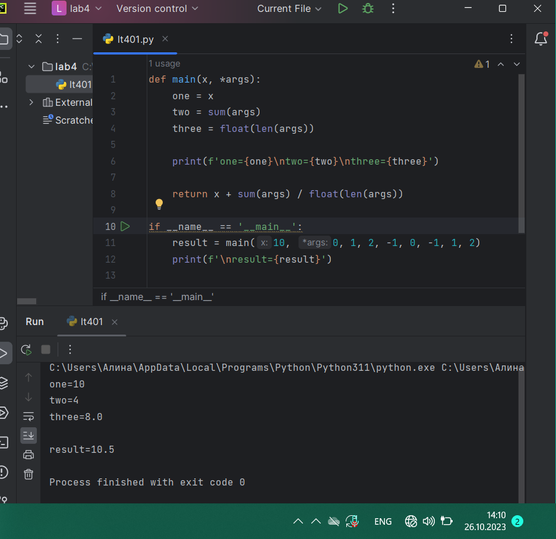
## Лабораторная работа №5
### Напишите функцию, которая на вход получает кортеж “**kwargs” и при помощи цикла выводит значения, поступившие в функцию. На скриншоте ниже указаны два варианта вызова функции с “**kwargs” и два варианта работы с данными, поступившими в эту функцию. Комментарии в коде и теоретическая часть помогут вам разобраться в этом нелегком аспекте. Вызовите функцию используя “точку входа”.

### Результат.
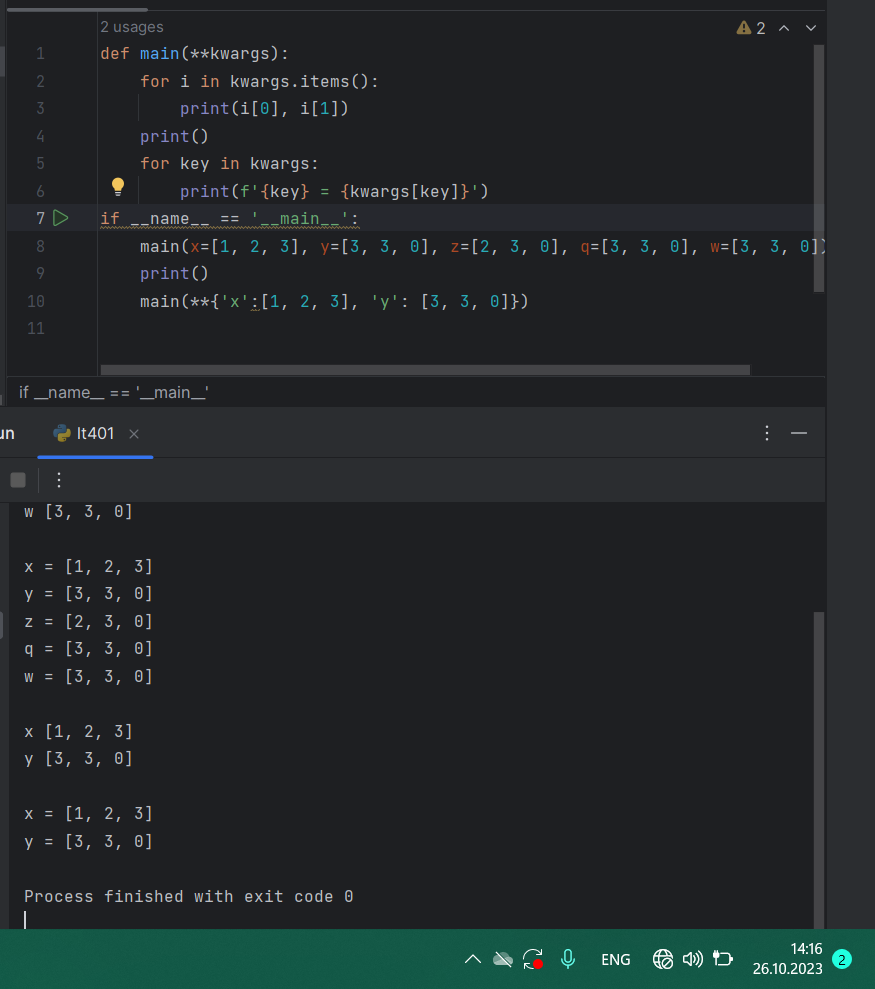
## Лабораторная работа №6
### Напишите две функции. Первая – получает в виде параметра “**kwargs”. Вторая считает среднее арифметическое из значений первой функции. Вызовите первую функцию используя “точку входа” и минимум 4 аргумента.

### Результат.
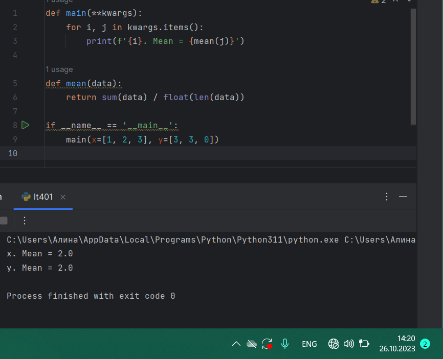
## Лабораторная работа №7
### Создайте дополнительный файл .py. Напишите в нем любую функцию, которая будет что угодно выводить в консоль, но не вызывайте ее в нем. Откройте файл main.py, импортируйте в него функцию из нового файла и при помощи “точки входа” вызовите эту функцию.

### Результат.
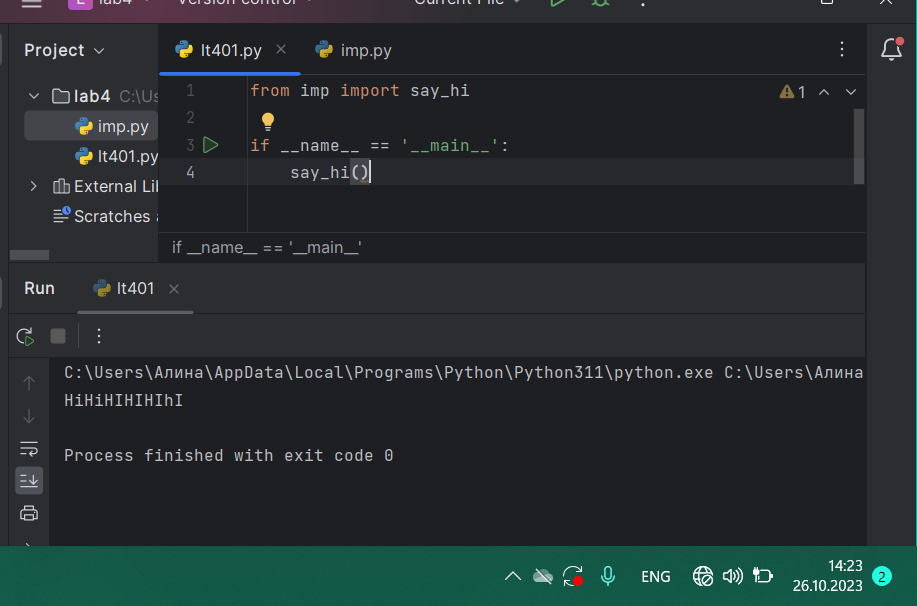
## Лабораторная работа №8
### Создайте дополнительный файл .py. Напишите в нем любую функцию, 
которая будет что угодно выводить в консоль, но не вызывайте ее в 
нем. Откройте файл main.py, импортируйте в него функцию из нового 
файла и при помощи “точки входа” вызовите эту функцию.

### Результат.
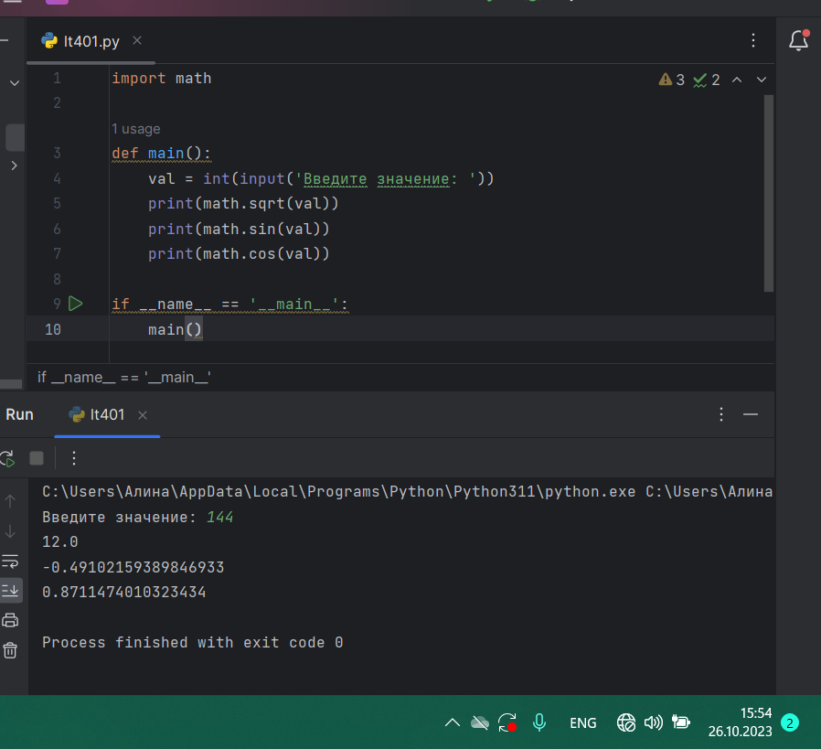
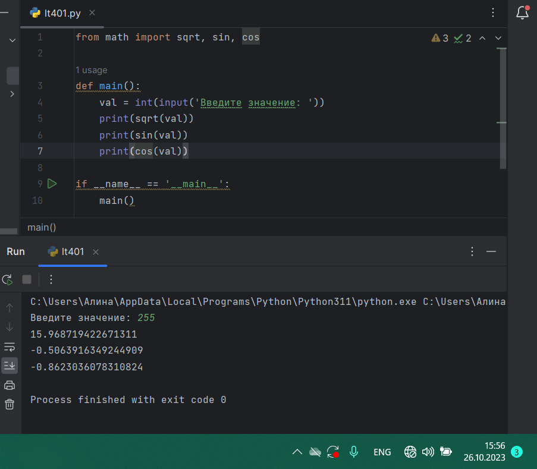
## Лабораторная работа №9
### Напишите программу, которая будет рассчитывать какой день недели 
будет через n-нное количество дней, которые укажет пользователь.

### Результат.
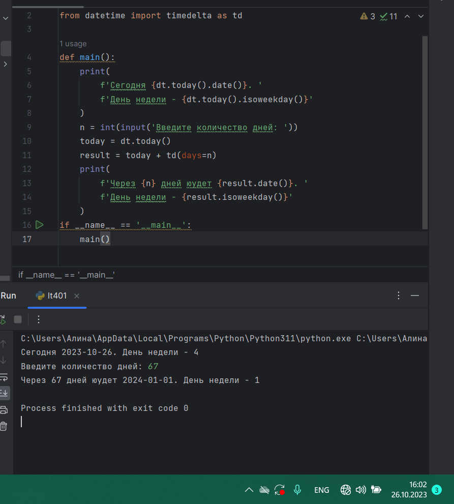
## Лабораторная работа №10
### Напишите программу с использованием глобальных переменных, 
которая будет считать площадь треугольника или прямоугольника в 
зависимости от того, что выберет пользователь. Получение всей 
необходимой информации реализовать через input(), а подсчет 
площадей выполнить при помощи функций. Результатом программы 
будет число, равное площади, необходимой фигуры

### Результат.
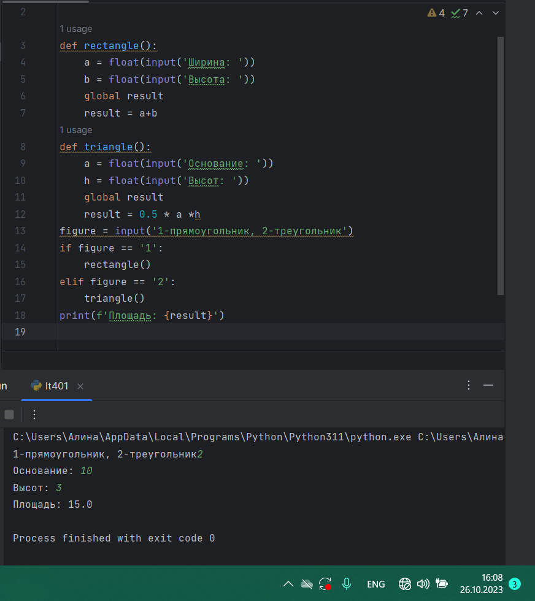

## Самостоятельная работа №1
###  Дайте подробный комментарий для кода, написанного ниже. Комментарий нужен для каждой строчки кода, нужно описать что она делает. Не забудьте, что функции комментируются по-особенному.
```python
from datetime import datetime #импортируем datetime
from math import sqrt #импортируем корень из модуля math

def main(**kwargs):
    """функия принимает произвольное количество аргументов"""
    for key in kwargs.items(): #перебираем все ключевые слова и их значения
        result = sqrt(key[1][0] ** 2 + key[1][1] ** 2)
        print(result) #вывод результата

if __name__ == '__main__': #точка входа
    start_time = datetime.now() #присваивание переменной текущее время
    main(
        one=[10, 3],
        two=[5, 4],
        three=[15, 13],
        four=[93, 53],
        five=[133,15]
    ) # передаем в main аргументы

time_costs = datetime.now() - start_time #вычитание из текущего времени стартовое
print(f'Время выполнения программы - {time_costs}')#вывод
```
### Результат.
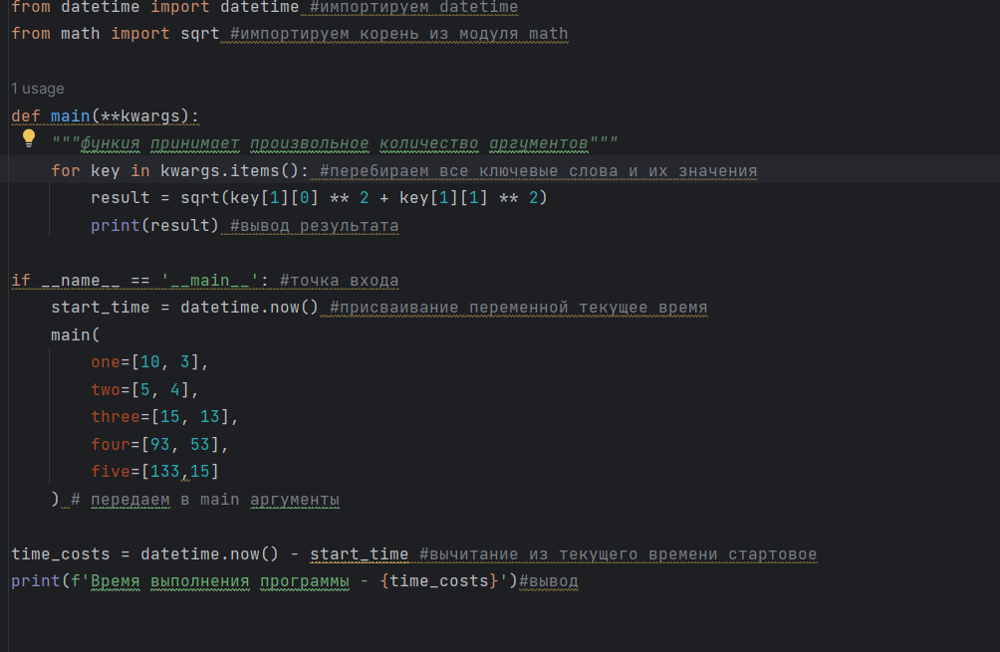

## Вывод
Научилась комментировать готовые работы, было сложно://

## Самостоятельная работа №2
###  Напишите программу, которая будет заменять игральную кость с 6 гранями. Если значение равно 5 или 6, то в консоль выводится «Вы победили», если значения 3 или 4, то вы рекурсивно должны вызвать эту же функцию, если значение 1 или 2, то в консоль выводится «Вы проиграли». При этом каждый вызов функции необходимо выводить в консоль значение “кубика”
```python
import random

def main():
    value = random.randint(1, 6)
    print('На кубике выпало число: ', value)

    if (value == 5 or 6):
        print('Вы выиграли')
    elif value == 1 or 2:
        print('Вы проиграли')
    else:
        main()

if __name__ == '__main__':
    main()
```
### Результат.
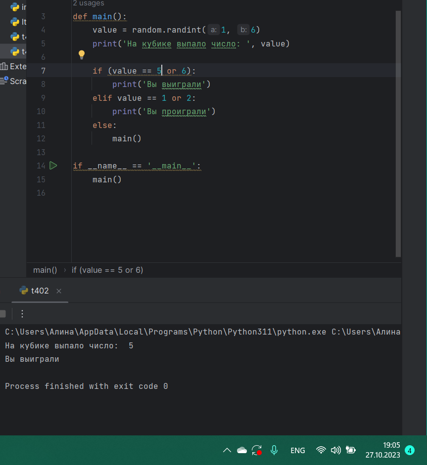

## Вывод
Освежила знания в работе с условием. Изучила работу функции

## Самостоятельная работа №3
###  Напишите программу, которая будет выводить текущее время, с 
точностью до секунд на протяжении 5 секунд. Программу нужно 
написать с использованием цикла. Подсказка: необходимо 
использовать модуль datetime и time, а также вам необходимо как-то 
“усыплять” программу на 1 секунду.
```python
from datetime import datetime
from time import sleep

for c in range(5):
    now = datetime.now()
    print(now.strftime("%H:%M:%S"))
    sleep(1)
```
### Результат.
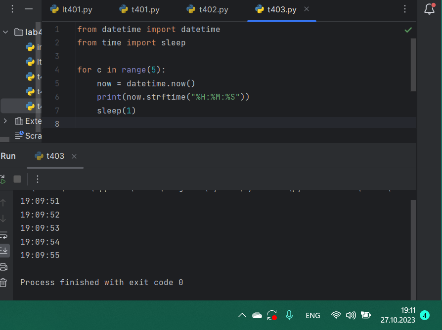

## Вывод
Научилась импортировать модули и применять их в работе. Познакомилась с модулем datetime and time

## Самостоятельная работа №4
###  Напишите программу, которая считает среднее арифметическое от 
аргументов вызываемое функции, с условием того, что изначальное 
количество этих аргументов неизвестно. Программу необходимо
реализовать используя одну функцию и “точку входа”.


```python
def average(*args):
    avg = sum(args) / len(args)
    return avg


if __name__ == "__main__":
    print('Средгее арифметическое аргументов: ',
          average(1, 5, 8, 2345, 0, -689))
```
### Результат.
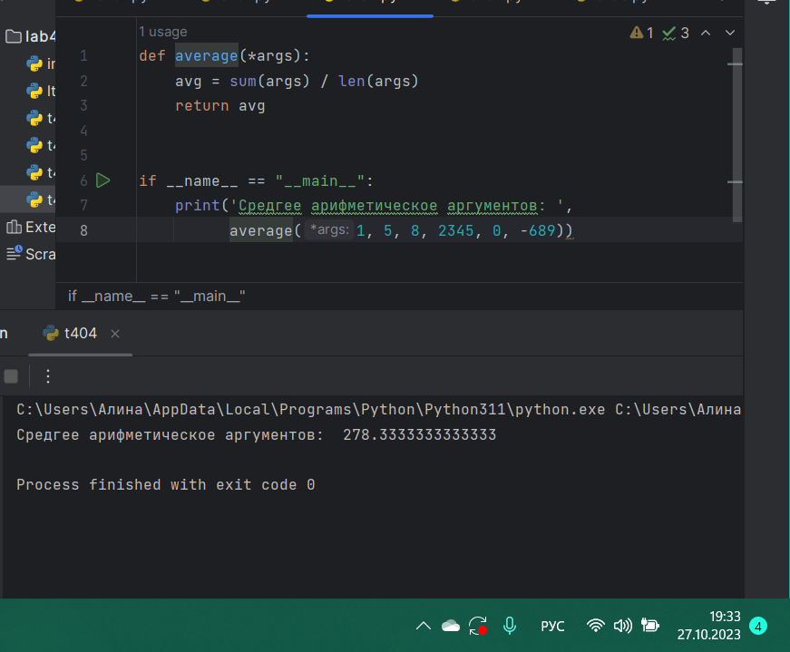

## Вывод
Научилась работать с аргументами

## Самостоятельная работа № 5
###   Создайте два Python файла, в одном будет выполняться вычисление 
площади треугольника при помощи формулы Герона (необходимо 
реализовать через функцию), а во втором будет происходить 
взаимодействие с пользователем (получение всей необходимой 
информации и вывод результатов). Напишите эту программу и 
выведите в консоль полученную площадь.
```python
import math

def tr(a, b, c):
    p = (a + b + c) / 2
    s = math.sqrt(p * (p - a) * (p - b)* (p - c))
    return s
```
```python
from t405_1 import tr

a = int(input('Введите сторону а: '))
b = int(input('Введите сторону b: '))
c = int(input('Введите сторону с: '))

area = tr(a, b, c)
print('Площадь треугольника равна ', area)
```
### Результат.
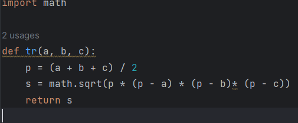


## Вывод
Научилась работаь с двумя файлами одновременно. Импортировала модуль math.

# Глобальный вывод
## Никогда раньше не работала с функциями и модулями. Функции упрощяют жизнь!  Было сложно, но я вывезла и все сделала!:-)) 
