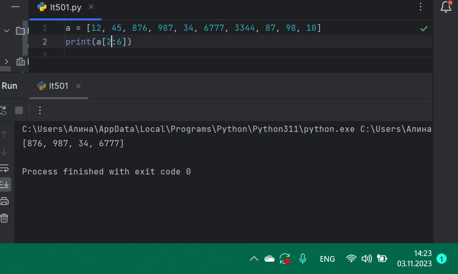

# Тема 5. Базовые коллекции: Множества и списки.
Отчет по Теме #5 выполнила:
- Фаухиева Алина Ильдаровна
- АИС-21-1

| Задание | Лаб_раб | Сам_раб |
| ------ | ------ | ------ |
| Задание 1 | + | + |
| Задание 2 | + | + |
| Задание 3 | + | + |
| Задание 4 | + | + |
| Задание 5 | + | + |
| Задание 6 | + |
| Задание 7 | + | 
| Задание 8 | + | 
| Задание 9 | + | 
| Задание 10 | + | 

знак "+" - задание выполнено; знак "-" - задание не выполнено;

Работу проверили:
- к.э.н., доцент Панов М.А.

## Лабораторная работа №1
### 

### Результат.


## Лабораторная работа №2
### 

### Результат.


## Лабораторная работа №3
### 

### Результат.


## Лабораторная работа №4
### 

### Результат.


## Лабораторная работа №5
### 

### Результат.


## Лабораторная работа №6
### 

### Результат.


## Лабораторная работа №7
### 

### Результат.


## Лабораторная работа №8
### 

### Результат.


## Лабораторная работа №9
### 

### Результат.


## Лабораторная работа №10
### 

### Результат.


## Самостоятельная работа №1
###  Задание:
Ресторан на предприятии ведет учет посещений за неделю при помощи 
кода работника. У них есть список со всеми посещениями за неделю. 
Ваша задача почитать:
• Сколько было выдано чеков
• Сколько разных людей посетило ресторан
• Какой работник посетил ресторан больше всех раз
```python
my_list = [8734, 2345, 8201, 6621, 9999, 1234, 5678, 8201, 8888, 4321, 3365,
 1478, 9865, 5555, 7777, 9998, 1111, 2222, 3333, 4444, 5556, 6666,
 5410, 7778, 8889, 4445, 1439, 9604, 8201, 3365, 7502, 3016, 4928,
 5837, 8201, 2643, 5017, 9682, 8530, 3250, 7193, 9051, 4506, 1987,
 3365, 5410, 7168, 7777, 9865, 5678, 8201, 4445, 3016, 4506, 4506]
print('Количество выданных чеков: ', len(my_list))
new_list = set()
number = 0
kod = 0
for item in my_list:
    count = my_list.count(item)
    if count > number:
        number = count
        kod = item
    new_list.add(item)
print('Количесвто людей посетивших ресторан: ', len(new_list))
print(f'Работник с кодом {kod} посетил ресторан {number} раз')
```
### Результат.


## Вывод
Научилась работать со списками. Закрепила знания в работе с циклами

## Самостоятельная работа №2
###  Задание:
На физкультуре студенты сдавали бег, у преподавателя физкультуры 
есть список всех результатов, ему нужно узнать
• Три лучшие результата
• Три худшие результата
• Все результаты начиная с 10
```python
my_list = [10.2, 14.8, 19.3, 22.7, 12.5, 33.1, 38.9, 21.6, 26.4, 17.1, 30.2, 35.7, 16.9,
27.8, 24.5, 16.3, 18.7, 31.9, 12.9, 37.4]
sort_list = sorted(my_list)
print("Три лучших результата: ", sort_list[0:3])
print("Три худших результата: ", sort_list[-3:])
print("Все результаты начиная с 10: ", my_list[9:])
```
### Результат.


## Вывод
Научилась работаь со срезами
## Самостоятельная работа №3
###  Задание:
Преподаватель по математике придумал странную задачку. У вас есть 
три списка с элементами, каждый элемент которых – длина стороны 
треугольника, ваша задача найти площади двух треугольников, 
составленные из максимальных и минимальных элементов полученных 
списков. Результатом выполнения задачи будет: листинг кода, и вывод 
в консоль, в котором будут указаны два этих значения
```python
from math import sqrt
def area(a, b, c):
    p = (a + b + c)/2
    s = sqrt(p * (p -a) * (p - b) * (p -c))
    return s
one = [12, 25, 3, 48, 71]
two = [5, 18, 40, 62, 98]
three = [4, 21, 37, 56, 84]
a1, a2 = max(one), min(one)
b1, b2 = max(two), min(two)
c1, c2 = max(three), min(three)

print('Площадь треугольника из макс элементов: ', area(a1, b1, c1))
print('Площадь треугольника из мин элементов: ', area(a2, b2, c2))
```
### Результат.


## Вывод
Научилась доставать макс и мин элемент из списка. Закрепила знания в работе с функцией.
## Самостоятельная работа №4
###  Задание:
Никто не любит получать плохие оценки, поэтому Борис решил это 
исправить. Допустим, что все оценки студента за семестр хранятся в 
одном списке. Ваша задача удалить из этого списка все двойки, а все 
тройки заменить на четверки.
```python
def good(mark):
    my_list = []
    for item in mark:
        if item != 2:
            if item == 3:
                item = 4
            my_list.append(item)
    print(my_list)
a = [2, 3, 4, 5, 3, 4, 5, 2, 2, 5, 3, 4, 3, 5, 4]
b = [4, 2, 3, 5, 3, 5, 4, 2, 2, 5, 4, 3, 5, 3, 4]
c= [5, 4, 3, 3, 4, 3, 3, 5, 5, 3, 3, 3, 3, 4, 4]
good(a)
good(b)
good(c)

```
### Результат.


## Вывод
Работала с функцией, которая заменяет оценки по правилу
## Самостоятельная работа №5
###  Задание:
Вам предоставлены списки натуральных чисел, из них необходимо
сформировать множества. При этом следует соблюдать это правило: 
если какое-либо число повторяется, то преобразовать его в строку по 
следующему образцу: например, если число 4 повторяется 3 раза, то в 
множестве будет следующая запись: само число 4, строка «44», строка 
«444».
```python
list_1 = [1, 1, 3, 3, 1]
list_2 = [5, 5, 5, 5, 5, 5, 5]
list_3 = [2, 2, 1, 2, 2, 5, 6, 7, 1, 3, 2, 2]
def pravilo(a):
    a.sort()
    list = []
    number = a[0]
    str1 = ""
    for item in a:
        if number == item:
            number = item
            str1 += str(item)
            list.append(str1)
        else:
            number = item
            str1 = ""
            str1 += str(item)
            list.append(str1)
    for item in list:
        if len(item) == 1:
            list.remove(item)
            list.insert(0, int(item))
    print(list)
pravilo(list_1)
pravilo(list_2)
pravilo(list_3)
```
### Результат.


## Вывод
Создала функцию по правилу, которое было дано в задании.

# Глобальный вывод
В этой теме узнала много полезного, научилась работать со списками и закрепила знания в работе с функциями
