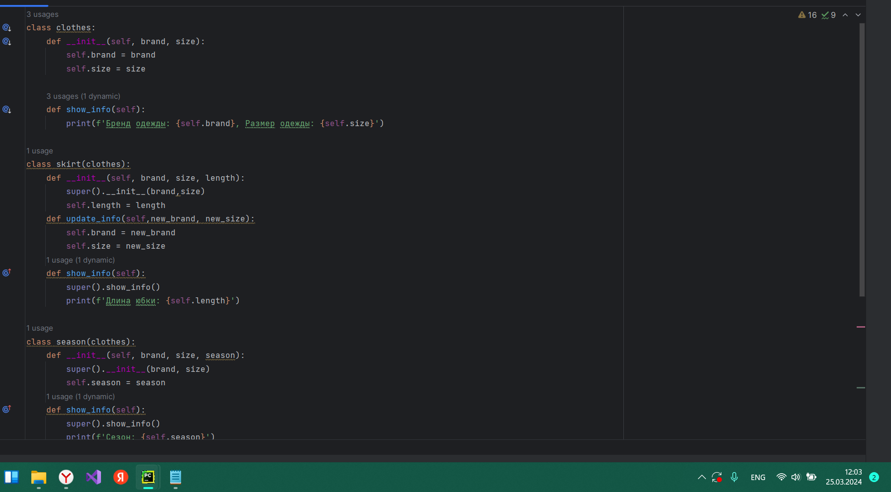
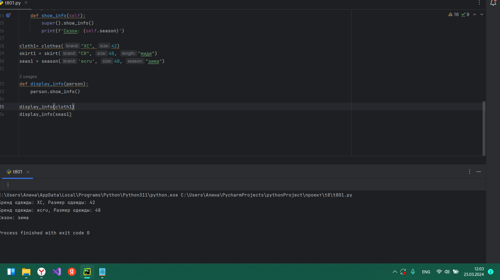

# Тема 8. Введение в ООП.
Отчет по Теме #8 выполнил:
- Фаухиева Алина Ильдаровна
- АИС-21-1

| Задание | Сам_раб | 
| ------ | ------ | 
| Задание 1 | + |
| Задание 2 | + |
| Задание 3 | + |
| Задание 4 | + |
| Задание 5 | + |

знак "+" - задание выполнено; знак "-" - задание не выполнено;

## Задание 1,2,3,4,5
### *Самостоятельно создайте класс и его объект. 
### *Самостоятельно создайте атрибуты и методы для ранее созданного класса.
### *Самостоятельно реализуйте наследование, продолжая работать с ранее созданным классом.
### *Самостоятельно реализуйте инкапсуляцию, продолжая работать с ранее созданным классом.
### *Самостоятельно реализуйте полиморфизм.
Они должны отличаться, от тех, что указаны в теоретическом материале (методичке) и лабораторных заданиях. 
Результатом выполнения задания будет листинг кода и получившийся вывод консоли.

### Результат.

## Вывод 
## 1),2) В этом примере класс Clothes  имеет атрибуты бренд(brand) и размер(size), а также метод показать_информацию(show_info) для вывода информации о одежде. Создается объект cloth1 с брендом "ХС" и размером 42, и вызывается метод показать_информацию для вывода информации об одежде.
## 3)В этом примере у нас есть базовый класс clothes и класс-наследник skirt. Класс skirt наследует атрибуты и методы от clothes и добавляет дополнительный атрибут lenght.
## 4)В данном примере атрибуты brand и size считаются публичными.
## 5)В этом примере season - это еще один подкласс clothes, который также переопределяет метод show_info. Затем мы создаем объекты разных классов и используем функцию display_info, которая вызывает метод show_info объекта. Это демонстрирует полиморфизм: несмотря на то, что у нас есть разные классы, они все могут использоваться вместе, так как они имеют схожий интерфейс.

